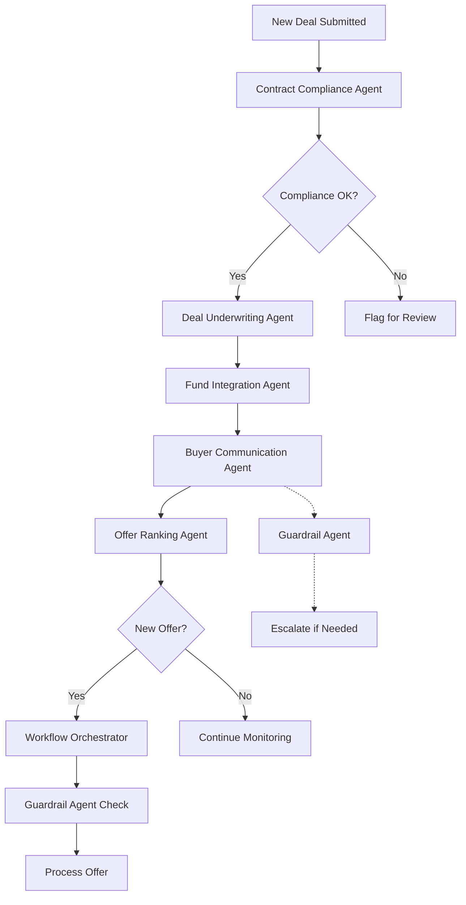

# 🤖 DispoTree AI Agents Overview

DispoTree employs 7 specialized AI agents to automate and optimize every stage of the wholesale real estate disposition process. Each agent has a specific domain of expertise and works in coordination through the Workflow Orchestrator to ensure seamless deal flow from intake to closing.

## 1. Contract Compliance Agent 📋

**Primary Role:** Contract analysis and compliance verification

**Core Functions:**
- Parse contracts from various formats (PDF, scans, images) using OCR and LLM extraction
- Extract critical fields: seller names, wholesaler entity, assignability clauses, marketing provisions
- Verify signer identities against LLC records and property ownership data
- Apply state-specific wholesale disclosure rules and marketing restrictions
- Generate compliance warnings (Green/Yellow/Red) based on detected issues
- Auto-create missing addenda and required disclosures

**Key Validation Points:**
- Assignment clause presence and language
- Marketing rights and restrictions
- Inspection period validity
- Signature authenticity and authority
- State-required wholesale disclosures

## 2. Deal Underwriting & Data Agent 📊

**Primary Role:** Property valuation and data completion

**Core Functions:**
- Pull Automated Valuation Models (AVM) from Xome and other APIs
- Generate rent estimates and rehab cost projections
- Auto-populate missing property fields from multiple data sources
- Provide quick comparable sales analysis
- Calculate key investment metrics (ARV, potential profit, ROI)
- Generate deal quality scores and investment recommendations

**Data Sources:**
- County assessor records
- MLS databases
- AVM providers
- Local market data
- Historical sales data

## 3. Fund Integration & Buy Box Agent 💰

**Primary Role:** Automated fund submission and buy box matching

**Core Functions:**
- Match incoming deals against institutional fund criteria
- Prepare fund-specific spreadsheet templates
- Handle email-based submissions for funds without APIs
- Manage follow-up communications and response parsing
- Track fund behavior and engagement patterns
- Route qualified deals to appropriate buyers automatically

**Process Flow:**
1. Receive new deal
2. Evaluate against all active buy boxes
3. Flag matching funds
4. Generate fund-specific submissions
5. Send emails with attachments
6. Track responses and parse replies
7. Escalate offers to human reviewers

## 4. Buyer Communication & Negotiation Agent 💬

**Primary Role:** Facilitate communication between buyers and wholesalers

**Core Functions:**
- Act as neutral communication buffer
- Relay questions and answers between parties
- Provide proactive status updates
- Facilitate offer negotiations without acting as broker
- Prevent direct contact attempts and platform circumvention
- Maintain professional, compliant tone throughout

**Communication Style:**
- Instant, helpful responses
- Clear, concise messaging
- Professional yet approachable tone
- Never reveals AI identity
- Strict compliance adherence

## 5. Offer Ranking & Behavior Analysis Agent 📈

**Primary Role:** Analyze buyer behavior and rank offers

**Core Functions:**
- Score buyer interest based on engagement patterns
- Analyze swipe behavior and viewing metrics
- Predict best offer likelihood using historical data
- Generate buyer activity reports
- Feed analytics into swipe algorithm improvements
- Identify hot leads and motivated buyers

**Metrics Tracked:**
- Response times
- Offer velocity
- View duration
- Swipe patterns
- Historical closing rates
- Question frequency

## 6. Guardrail & Compliance Enforcement Agent 🛡️

**Primary Role:** Ensure regulatory compliance and platform integrity

**Core Functions:**
- Monitor all communications for compliance violations
- Block attempts at direct contact between parties
- Detect potential fraudulent activity
- Redact personal contact information
- Escalate suspicious behavior to human reviewers
- Maintain audit logs of all compliance actions

**Red Flags:**
- Phone number or email sharing attempts
- "Let's meet directly" suggestions
- Broker-like behavior without license
- Requests to falsify information
- Attempts to bypass platform

## 7. Workflow Orchestrator 🎯

**Primary Role:** Coordinate all agents and manage deal flow

**Core Functions:**
- Route events to appropriate specialized agents
- Maintain conversation context and memory
- Log all agent actions and decisions
- Ensure smooth handoffs between agents
- Trigger automated workflows based on events
- Provide centralized monitoring and reporting

**Event Triggers:**
- New contract upload
- Deal submission
- Buyer inquiry
- Offer received
- Fund response
- Compliance flag
- Status change

## Agent Coordination Flow

## Implementation Benefits

### For Wholesalers
- **Reduced Workload**: Automated deal submission to multiple channels
- **Wider Distribution**: Access to funds, auctions, and buyers instantly
- **Compliance Assurance**: Built-in checks prevent legal issues
- **Better Prices**: Competitive bidding from multiple sources

### For Buyers
- **Curated Deals**: Only deals matching their criteria
- **Complete Information**: All required docs and data upfront
- **Efficient Process**: Quick responses and transparent communication
- **Direct Access**: No intermediaries or unnecessary delays

### For Platform
- **Scalability**: Handle high volume without proportional staff increase
- **Consistency**: Uniform process for all deals
- **Risk Reduction**: Automated compliance and fraud detection
- **Data Collection**: Rich analytics for continuous improvement

## Future Expansion

The modular agent architecture allows for easy addition of new capabilities:
- Market trend analysis agent
- Predictive pricing agent
- Automated document generation agent
- Virtual showing coordinator agent
- Closing management agent

Each new agent can integrate seamlessly with the existing ecosystem through the Workflow Orchestrator.