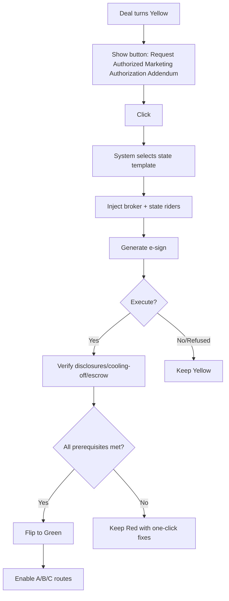

# Auto-Generated Marketing Authorization Addendum – Implementation Guide

## Auction Services Language

**Short answer:** Yes—do it. Auto-generating a state-specific Marketing Authorization Addendum is one of the highest-ROI compliance features you can ship. It speeds deals, standardizes language, and keeps your team out of "implied brokerage" trouble—as long as you add a few guardrails.

### Why It's a Good Idea

1. **Speed & Conversion**
   - One click to cure the "no marketing" problem → more deals reach A/B/C channels

2. **Consistent Compliance**
   - Bakes in the exact state disclosures / rescission / escrow where required

3. **Broker Alignment**
   - Automatically inserts your in-state broker when the state requires brokered marketing (SC, IL, PA; and OK/CT on their effective dates)

4. **Audit Trail**
   - E-sign + versioned templates = clean evidence if questioned by regulators or sellers

## Must-Have Guardrails (Keep It Safe)

### State Switchboard
Drive addendum content off your rules JSON:
- **Always special-handle:** AL, AZ, MD (10/1/25+), ND (8/1/25+), OK (11/1/25+), PA, SC, IL, TN, CT (7/1/26+)
- **Enforce effective dates** and property scope (e.g., AL = SFR only)

### Broker Insert Logic
If state requires broker for property marketing or auctions:
- Require broker metadata before generating the doc
- Include an MSA/listing-like rider

### Timing Gates
Do NOT enable Marketplace/Auction/Outreach until:
- Addendum executed
- All required disclosures delivered
- Any cooling-off text included
- Escrow set where required (e.g., OK)

### Version Control + Counsel Review
- Lock templates per state
- Record: template_version, sign_time, state_version
- Have outside counsel bless v1 and every material change

### Language Safety Rails
- Avoid creating agency with the seller
- Keep broker "for Buyer" only
- Avoid guaranteeing performance or price

### Fallbacks
If seller refuses to authorize marketing, keep the deal Yellow (no A/B/C)

## What the Auto-Generated Addendum Should Include (Modular Blocks)

### 1. Grant of Authority (Core)
Permission to market the property and/or Buyer's assignable contractual interest via:
- Private marketplace
- Auctions
- Outreach

### 2. Brokerage Rider (Where Required)
- Identifies Designated In-State Broker
- Confirms broker acts for Buyer (not Seller)
- Authorizes listing/auction representation if needed

### 3. Wholesale Disclosures (State-Specific)

**Arizona (AZ):**
- Wholesale-buyer disclosure to seller
- Equitable-interest disclosure to assignee

**Alabama (AL - SFR only):**
- Seller pre-marketing notice
- 3 business-day seller notice before assignment
- Assignee disclosure

**Pennsylvania (PA):**
- Licensure + consumer disclosures
- Cancellation rights

**Maryland (MD - 10/1/25+):**
- Seller intent-to-assign
- Assignee equitable-interest
- Rescission language

**Tennessee (TN):**
- Disclosures to seller and subsequent purchaser

**North Dakota (ND - 8/1/25+):**
- Equitable-interest + profit-intent disclosure to all parties

**Oklahoma (OK - 11/1/25+):**
- Homeowner disclosures
- 2-business-day cancellation
- Escrow
- No lien language

**South Carolina (SC):**
- Acknowledges statute: marketing requires broker
- Assignment alone isn't "wholesaling"

**Illinois (IL):**
- Recognizes wholesaling as licensed activity
- Includes license metadata

**Connecticut (CT - 7/1/26+):**
- Wholesaler registration refs
- Any mandated terms

### 4. No-Agency & Representation
- No agency created between Seller and Broker
- Seller acknowledges Broker is engaged by Buyer

### 5. Confidentiality/Marketing Carve-Out
- Seller permits photos, data use
- Distribution to buyers/platforms consistent with law

### 6. Notices & Delivery
- Email/e-sign acceptable

### 7. Survival/Priority Clause
- Addendum controls over PSA on marketing authority

## Example "Core" Clause (Safe Baseline)

```
Marketing & Brokerage Authorization. Seller authorizes Buyer and Buyer's designated licensed real estate broker in {STATE} ("Broker") to market the property and/or Buyer's assignable contractual interest by distributing information to private buyer networks and marketplaces, conducting buyer outreach, and engaging online auction platforms. Broker acts for Buyer only and no agency is created between Seller and Broker. Buyer and Broker will comply with all applicable {STATE} requirements, including any required disclosures, rescission/cancellation rights, and escrow. This authorization supplements and controls over the purchase agreement to the extent of any conflict regarding marketing.
```

## Product Flow (Simple & Tight)



## Implementation Checklist (Devs)

### Template Engine
- Tokens: {STATE}, {BROKER_NAME}, {LICENSE_NO}, {EFFECTIVE_DATE}, {ESCROW_AGENT}

### State Rules JSON
- Template/rider selector
- Precondition list

### E-Sign + Document Audit Trail
- Hash, signer IP/time
- template_version tracking

### Broker Directory
- Auto-assignment per state

### Feature Flags
- Marketplace/Auction/Outreach locked until all_preconditions == true

### Notifications
- Sender & reviewer notifications (already drafted in prior step)

## State-Specific Implementation Details

### High-Priority States (Immediate Implementation)

**Oklahoma (Effective 11/1/2025)**
```
Required blocks:
- Homeowner disclosure: "You have the right to cancel this contract at any time before midnight of _____"
- 2-business-day cancellation right
- Escrow requirements
- No lien/encumbrance prohibition
```

**Pennsylvania (Effective 1/4/2025)**
```
Required blocks:
- Licensure statement: "Wholesaling is brokering and requires PA license"
- Consumer disclosure requirements
- Cancellation rights (30 days with proper disclosure)
```

**South Carolina (Effective 5/21/2024)**
```
Required blocks:
- Marketing requires licensed broker acknowledgment
- Assignment carve-out clarification
- Broker acts for wholesaler only
```

### Medium-Priority States (Prepare for Effective Dates)

**Maryland (Effective 10/1/2025)**
- Monitor for final regulations
- Prepare disclosure templates

**North Dakota (Effective 8/1/2025)**
- Equitable interest disclosures
- Profit intent notifications

**Connecticut (Effective 7/1/2026)**
- Registration requirements
- Wholesaler disclosure language

## AI Agent Integration

### Contract Compliance Agent
- Validates addendum execution
- Confirms all state-specific blocks are present
- Checks broker inclusion where required
- Verifies disclosure completeness

### Workflow Orchestrator
- Triggers addendum generation for Yellow status
- Manages template selection based on state
- Coordinates e-sign routing
- Monitors prerequisite completion

### Guardrail & Compliance Agent
- Enforces timing gates
- Verifies escrow setup where required
- Monitors for unauthorized marketing attempts
- Maintains audit trail of all addendum activities

### Communication & Negotiation Agent
- Sends addendum requests to sellers
- Explains requirements clearly
- Facilitates quick execution
- Provides status updates

## Bottom Line

Yes, auto-generate it—with state-aware riders, broker logic, and gating. That gives you speed without sacrificing compliance.

## Testing & QA Checklist

1. **Template Testing**
   - [ ] Verify all state templates load correctly
   - [ ] Test token substitution for all variables
   - [ ] Confirm special state blocks appear when required

2. **Workflow Testing**
   - [ ] Yellow → Addendum generation → Green flow
   - [ ] Missing prerequisites keep deal Red/Yellow
   - [ ] Refused addendum keeps deal Yellow

3. **Compliance Testing**
   - [ ] State-specific disclosures trigger correctly
   - [ ] Broker assignment works for required states
   - [ ] Timing gates prevent premature marketing

4. **Integration Testing**
   - [ ] E-sign integration complete
   - [ ] Document audit trail recording
   - [ ] Notifications trigger correctly

5. **Edge Cases**
   - [ ] Property type restrictions (AL SFR only)
   - [ ] Effective date enforcement
   - [ ] Multi-state properties (use property state)