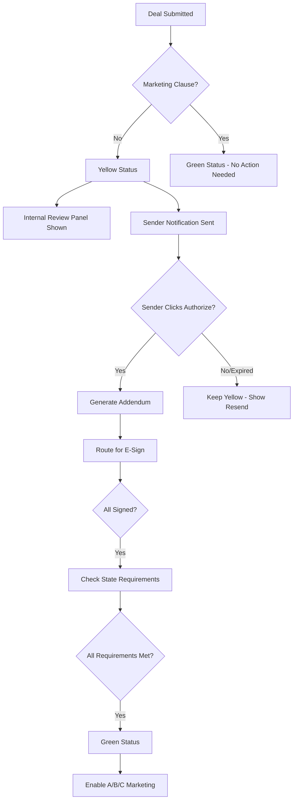

# Internal Review Process – Marketing Authorization Workflow

## Overview
100%. Show the decision to your internal reviewer and auto-notify the deal sender with a clear, friendly "what's needed" message. Here's a drop-in package:

## 1) Internal Reviewer Message (In-App Panel)

### Title: Marketing Not Authorized (Yellow)

**Status pill:** 🟡 Marketing Not Authorized

**Summary:** The purchase contract does not grant the buyer the right to market the property or the contract. Posting to ESO Marketplace, submitting to an auction, or prospecting new buyers would constitute marketing.

**Blocked routes:**
- A – ESO Marketplace (disabled)
- B – Online Auction (disabled)
- C – External Prospecting (disabled)

**Why blocked (computed):**
- Assignable: {{assignable_yes_no}}
- Marketing clause found: No
- Broker required in {{state}}: {{broker_required_yes_no}}
- State notices required (if later enabled): {{state_notices_list_or_None}}

**Next step (single CTA):**
```
Request Authorized Marketing Authorization Addendum
(This will route through our in-state broker and attach any state-required disclosures before enabling A/B/C.)
```

**Compliance notes (collapsed accordion):**
- "Marketing" includes private marketplace posts, auctions, and outreach beyond a single named counterparty
- State overlays may require broker involvement and specific disclosures once authorization is obtained (e.g., AL, AZ, MD, ND, OK, PA, SC, TN, CT)
- Until the addendum is fully executed (and any required notices/escrow are set), A/B/C remain disabled

**Have Reviewer initiate to Sender**

## 2) Sender Notification (Auto-Outbound)

Send one concise notice, same content for email + in-app + optional SMS, with friendly tone and a single action.

### Email (Recommended)

**Subject:** Quick fix needed to advance your deal on ESO

**Body:**
```
Hi {{sender_first_name}},

Thanks for submitting {{property_short}}. Our review found that the current purchase contract doesn't include permission to market the property or the assignable contract. Because of that, we can't post it to the ESO Marketplace, send it to auction, or conduct buyer outreach yet.

Good news: This is usually a quick addendum. Click below and we'll send the Authorized Marketing Authorization Addendum for e-signature (we'll route it through our in-state broker and attach any state-required disclosures).

Authorize Marketing (1-click)

Once signed, we'll enable distribution and push your deal to the right channels.

Questions? Reply here or call {{support_phone}}.

— ESO Compliance Team
```

### SMS (Optional)
*If consent on file; keep < 320 chars*

```
ESO: We reviewed {{property_short}}. We need a simple Marketing Authorization Addendum before we can market/post the deal. Tap to authorize: {{short_link}} —ESO Compliance
```

### In-App Banner (Sender Dashboard) - DEAL TRACKER

```
Action needed to advance your deal
Your contract doesn't authorize marketing. We've prepped a simple Marketing Authorization Addendum (with broker + state notices).

[Authorize Marketing]
```

## 3) Automation Logic (Who Gets What, When)

**Trigger:** Deal status flips to Yellow (no marketing clause).

### Do Immediately:
- Post the Internal reviewer panel (above)
- Create a single outbound notification to the sender:
  - Email → send now
  - In-app banner → show until addendum is fully executed
  - SMS → only if sender_sms_opt_in == true

### Do NOT:
- Do not send multiple emails if the reviewer re-opens/re-saves; throttle by status change only
- Do not expose legal minutiae; keep sender copy action-focused

### If Sender Clicks "Authorize Marketing":
1. Generate Marketing Authorization & Brokerage Addendum (state-aware), route for e-sign to Seller (and any needed parties)
2. Auto-attach state riders and disclosure packets (seller + assignee, cooling-off, escrow where required)
3. If state requires broker and none is assigned, auto-assign the in-state broker profile and attach MSA/listing-like engagement
4. On full execution (all signatures + required notices satisfied + escrow set if required):
   - Flip deal to Green
   - Enable A/B/C routing
   - Send sender a success email: "You're all set—your deal is now marketable."

### If Declined or Expired:
- Keep Yellow, show "Authorization declined/expired" tag to reviewer and sender
- Provide Resend button (once per 24h)

## 4) Optional: Micro-Copy Variants by State (Auto-Insert)

**AL (single-family):**
"This addendum also provides the required seller notice and assignee disclosure under Alabama law."

**OK (from 11/1/2025):**
"We'll include Oklahoma's 2-business-day cancellation notice and escrow instructions."

**PA:**
"Wholesaling requires licensure and specific disclosures; we'll attach those automatically."

**SC:**
"Marketing must run through our licensed broker; the addendum covers this requirement."

**MD (from 10/1/2025), ND (from 8/1/2025), TN, AZ, CT (from 7/1/2026):**
"We'll include the state-required wholesale disclosures and any rescission/registration language."

## 5) Data Fields Your System Needs for the Templates

### Required Fields:
- `sender_first_name`
- `property_short` (e.g., "123 Main St, Phoenix" or "Phoenix SFR")
- `magic_link` (secure one-click to the e-sign flow)
- `support_phone`
- `sender_sms_opt_in` (true/false)
- `state`
- `deal_date`
- `property_type`
- `assignable` (bool)
- `marketing_clause.present` (bool)
- `broker_on_file` (bool)
- `state_required_items` (array -> used in the internal panel)

## 6) QA Checks

1. If contract becomes authorized (addendum signed), ensure:
   - Sender banner + email stop
   - Status flips to Green

2. Make sure A/B/C toggles stay disabled until all state preconditions are satisfied:
   - Disclosures
   - Rescission text
   - Escrow
   - Broker
   - NOT just the addendum signature

## Process Flow Summary



## AI Agent Integration

### Workflow Orchestrator:
- Monitors deal status changes
- Triggers appropriate notifications based on status
- Manages the Yellow → Green transition
- Tracks authorization attempts and resends

### Communication & Negotiation Agent:
- Sends the outbound notifications
- Maintains friendly, action-focused messaging
- Handles sender questions about the process
- Provides support contact information

### Contract Compliance Agent:
- Verifies addendum execution
- Confirms all state requirements are met
- Validates broker assignments
- Checks disclosure completeness

### Guardrail & Compliance Agent:
- Ensures A/B/C remains disabled until full compliance
- Monitors for unauthorized marketing attempts
- Maintains audit trail of all authorization processes
- Flags any deviations from the workflow

This gives your reviewer clarity, your sender one clean path forward, and your system a simple, enforceable workflow.