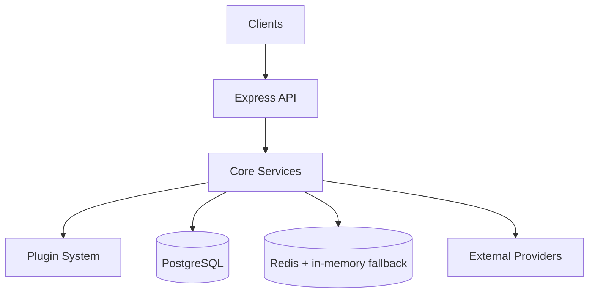

# Dispotree Backend

A sophisticated real estate wholesaling and deal distribution platform that automates matching investment properties with hedge funds and institutional buyers.

## Table of Contents

- [Overview](#overview)
- [Feature Inventory](#feature-inventory)
- [System Architecture](#system-architecture)
- [Getting Started](#getting-started)
- [API Documentation](#api-documentation)
- [Plugin System](#plugin-system)
- [DispoCrawl - AI Web Crawler](#dispocrawl---ai-web-crawler)
- [AI Agents](#ai-agents)
- [Deal Marketplace](#deal-marketplace)
- [Database Schema](#database-schema)
- [Configuration](#configuration)

---

## Overview

Dispotree is a B2B real estate intelligence platform that:

- **Crawls listings** with DispoCrawl AI-powered web scraper (Zillow, MLS, wholesaler sites)
- **Aggregates deals** from multiple sources (CSV, API, Email, Webhooks, Manual entry)
- **Ensures compliance** of wholesale contracts
- **Matches properties to buyers** using AI-powered buy box scoring
- **Distributes deals** to Xome (auction platform) and hedge funds
- **Persists to database** with full PostgreSQL integration

```
┌─────────────────────────────────────────────────────────────────────────────┐
│                           DISPOTREE PLATFORM                                │
├─────────────────────────────────────────────────────────────────────────────┤
│                                                                             │
│   ┌──────────────┐    ┌──────────────┐    ┌──────────────┐                 │
│   │  Wholesalers │    │  MLS Feeds   │    │  Direct API  │                 │
│   └──────┬───────┘    └──────┬───────┘    └──────┬───────┘                 │
│          │                   │                   │                          │
│          └───────────────────┼───────────────────┘                          │
│                              │                                              │
│   ┌──────────────────────────┼──────────────────────────┐                  │
│   │                          ▼                          │                  │
│   │  ┌─────────────┐  ┌─────────────┐  ┌─────────────┐ │                  │
│   │  │ DispoCrawl  │  │    CSV      │  │   Email     │ │                  │
│   │  │ (AI Crawl)  │  │   Import    │  │   Parser    │ │                  │
│   │  └──────┬──────┘  └──────┬──────┘  └──────┬──────┘ │                  │
│   │         └────────────────┼────────────────┘        │                  │
│   │                          ▼                          │                  │
│   │                ┌─────────────────┐                 │                  │
│   │                │  Deal Ingestion │                 │                  │
│   │                │    (Plugins)    │                 │                  │
│   │                └────────┬────────┘                 │                  │
│   └─────────────────────────┼──────────────────────────┘                  │
│                             │                                               │
│          ┌──────────────────┼──────────────────┐                           │
│          ▼                  ▼                  ▼                            │
│   ┌─────────────┐   ┌─────────────┐   ┌─────────────┐                      │
│   │ Compliance  │   │  Buy Box    │   │  Guardrail  │                      │
│   │   Agent     │   │   Agent     │   │   Agent     │                      │
│   └──────┬──────┘   └──────┬──────┘   └─────────────┘                      │
│          │                 │                                                │
│          └────────┬────────┘                                                │
│                   ▼                                                         │
│          ┌─────────────────┐                                                │
│          │   Distribution  │                                                │
│          └────────┬────────┘                                                │
│                   │                                                         │
│     ┌─────────────┼─────────────┐                                          │
│     ▼             ▼             ▼                                           │
│ ┌───────┐   ┌───────────┐   ┌───────┐                                      │
│ │ Xome  │   │Hedge Funds│   │  MLS  │                                      │
│ └───────┘   └───────────┘   └───────┘                                      │
│                                                                             │
└─────────────────────────────────────────────────────────────────────────────┘
```

---

## Feature Inventory

A quick reference of all working features in the Dispotree backend.

### API Endpoints Summary

| Module | Path | Endpoints | Description |
|--------|------|-----------|-------------|
| **Properties** | `/api/listings` | 5 | CRUD operations for property listings |
| **Xome** | `/api/xome` | 2 | Xome marketplace integration |
| **Hedge Funds** | `/api/hedgefunds` | 6 | Fund matching, CSV generation, submissions, AI import |
| **AI** | `/api/ai` | 7 | Compliance, buy box matching, guardrails |
| **Agent** | `/api/agent` | 8 | Conversational AI with 67 tools + predictive analytics |
| **Plugins** | `/api/plugins` | 50+ | Sources, automations, workflows, browser |
| **Marketplace** | `/api/marketplace` | 25+ | Swipe, offers, analytics, comparison |
| **ML** | `/api/ml` | 12 | Training, predictions, model management |
| **Pipeline** | `/api/pipeline` | 15 | Deal pipeline stages, bulk actions, export |
| **Portfolio** | `/api/portfolio` | 12 | Property portfolio tracking, valuations, export |
| **Analytics** | `/api/analytics` | 20 | Win/loss, agent metrics, daily digest |
| **Webhooks** | `/api/webhooks` | 3 | DocuSeal, generic webhook receivers |

**Total: 190+ API endpoints**

### Deal Source Plugins

| Plugin | File | Capability |
|--------|------|------------|
| **CSV** | `CSVDealSourcePlugin.ts` | Import from CSV files with delimiter support |
| **API** | `APIDealSourcePlugin.ts` | Fetch from REST APIs with pagination & OAuth |
| **Email** | `EmailDealSourcePlugin.ts` | Parse deals from forwarded emails |
| **Webhook** | `WebhookDealSourcePlugin.ts` | Receive via webhooks (signature verification, rate limiting, deduplication) |
| **Manual** | `ManualDealSourcePlugin.ts` | Manual deal entry with validation |
| **Firecrawl** | `FirecrawlDealSourcePlugin.ts` | AI web scraping with scheduled crawls |

### AI & ML Features

| Feature | Location | Description |
|---------|----------|-------------|
| **Conversational Agent** | `agentService.ts` | LangChain agent with 67 tools |
| **Compliance Analysis** | `aiComplianceController.ts` | Contract review (Green/Yellow/Red status) |
| **Content Moderation** | `aiGuardrailController.ts` | Phone/email/circumvention detection |
| **Deal Quality Model** | `DealQualityModel.ts` | TensorFlow.js predictions |
| **Fund Match Model** | `MLScoringPlugin.ts` | ML-enhanced fund matching |
| **Close Probability** | `MLService.ts` | Deal close prediction |
| **Deal Analysis** | `DealAnalysisService.ts` | Enrichment from Zillow, ATTOM, Rentometer |
| **RAG Knowledge Base** | `knowledge/` | Semantic search over documents |
| **Long-term Memory** | `MemoryService.ts` | Pinecone-powered user preference storage |
| **Buy Box OCR Import** | `BuyBoxImportService.ts` | GPT-4 Vision extracts buy boxes from documents |
| **Smart Contact Routing** | `HedgeFundBuyBox.ts` | Auto-match market contacts to properties |

### Deal Pipeline & Portfolio

| Feature | Location | Description |
|---------|----------|-------------|
| **Pipeline Tracking** | `PipelineService.ts` | Track deals through 7 stages (new → closed) |
| **Stage History** | `DealPipeline.ts` | Full audit trail of stage transitions |
| **Portfolio Management** | `PortfolioService.ts` | Track owned properties with valuations |
| **Win/Loss Analysis** | `WinLossService.ts` | Learn from closed deals, identify patterns |
| **Agent Metrics** | `AgentMetricsService.ts` | Track AI agent accuracy over time |
| **Conversion Rates** | `PipelineService.ts` | Funnel analytics by stage |

### E-Signature & Contracts

| Feature | Location | Description |
|---------|----------|-------------|
| **DocuSeal Integration** | `DocuSealService.ts` | E-signature via DocuSeal API |
| **Contract Templates** | DocuSeal | Reusable contract templates |
| **Webhook Events** | `webhookRoutes.ts` | Auto-update pipeline on signature events |
| **Agent Tools** | `agentService.ts` | Send contracts via chat interface |

### Automation & Workflow Engine

| Component | File | Capability |
|-----------|------|------------|
| **Automation Engine** | `AutomationEngine.ts` | Event-driven rules (deal.received, deal.scored, deal.matched) |
| **Workflow Engine** | `WorkflowEngine.ts` | Multi-step processing with human review gates |
| **Scoring Engine** | `ScoringEngine.ts` | Weighted buy box matching (geographic 30%, price 25%, etc.) |
| **Retry Queue** | `AutomationEngine.ts` | Exponential backoff for failed actions |
| **Dead Letter Queue** | `DeadLetterQueue.ts` | Track and retry failed operations with error context |
| **Follow-up Chains** | `FollowUpService.ts` | Automated multi-step follow-up campaigns |
| **Slack Notifications** | `AutomationEngine.ts` | Send deal alerts to Slack channels |
| **Discord Notifications** | `AutomationEngine.ts` | Send deal alerts to Discord with rich embeds |
| **WebSocket Updates** | `index.ts` | Real-time notifications via Socket.IO |

**Workflow Templates:** Standard Deal Processing, Fast Track, High Value Review

### Caching & Performance

| Feature | Location | Description |
|---------|----------|-------------|
| **Redis Service** | `RedisService.ts` | Centralized caching with in-memory fallback |
| **Buy Box Score Caching** | `ScoringEngine.ts` | Cache scoring results for 1 hour (reduces repeat requests from ~2s to ~5ms) |
| **Market Data Caching** | `MarketDataService.ts` | Two-layer cache (L1: in-memory, L2: Redis) for Zillow data |
| **Conversation Caching** | `agentService.ts` | 3-layer cache for chat history (memory → Redis → database) |
| **Rate Limiting** | `RedisService.ts` | Distributed rate limiting for API endpoints |

### Storage & Media

| Feature | Location | Description |
|---------|----------|-------------|
| **Supabase Storage** | `PhotoPersistenceService.ts` | Cloud storage for property photos |
| **Photo Management** | `PhotoPersistenceService.ts` | Upload, retrieve, and manage property images |

### Team Notifications & Reporting

| Feature | Location | Description |
|---------|----------|-------------|
| **Daily Digest Email** | `DigestService.ts` | Automated daily summary of new deals, stale deals, win/loss stats |
| **Slack Webhooks** | `AutomationEngine.ts` | Real-time deal alerts to Slack channels |
| **Discord Webhooks** | `AutomationEngine.ts` | Rich embed notifications to Discord servers |
| **Pipeline Export** | `pipelineRoutes.ts` | Export pipeline to CSV/JSON |
| **Portfolio Export** | `portfolioRoutes.ts` | Export portfolio to CSV/JSON |
| **Bulk Actions** | `pipelineRoutes.ts` | Bulk stage updates, closes, and deletes |

### Duplicate Detection

| Method | Location | Description |
|--------|----------|-------------|
| **External ID** | `propertyService.ts` | Match by unique property identifier |
| **Address Matching** | `propertyService.ts` | Normalized street address comparison |
| **Phone Matching** | `propertyService.ts` | Match owner/contact phone numbers |
| **Email Matching** | `propertyService.ts` | Match owner/contact email addresses |

### Browser Automation

| Feature | File | Capability |
|---------|------|------------|
| **Auction Submission** | `AuctionSubmissionPlugin.ts` | Submit to Xome, Hubzu, Auction.com, Zillow |
| **Human Behavior** | `HumanBehavior.ts` | Realistic typing, mouse movement, delays |
| **Stealth Mode** | `StealthConfig.ts` | Anti-bot detection evasion |
| **CAPTCHA Solving** | `CaptchaSolver.ts` | 2Captcha/Anti-Captcha integration |
| **Proxy Rotation** | `ProxyManager.ts` | Reliable multi-IP access |
| **Credential Store** | `SecureCredentialStore.ts` | Encrypted password storage |
| **Smart Selectors** | `SmartSelector.ts` | AI-powered field detection |

### Marketplace Features

| Feature | Description |
|---------|-------------|
| **Swipe Interface** | Tinder-like like/pass with feedback tracking |
| **Personalized Feed** | Deals ranked by buy box match score |
| **Deal Comparison** | Side-by-side analysis (2-5 deals) |
| **Offer System** | Submit, counter, accept/reject offers |
| **User Profiling** | Behavior learning and interest predictions |
| **Real-time Notifications** | WebSocket-based alerts |

### Data Models

| Model | Purpose |
|-------|---------|
| `Property` | Property listings with 90+ fields |
| `HedgeFundBuyBox` | Fund investment criteria |
| `UserBuyBox` | User investment preferences |
| `MarketplaceUser` | User profiles and roles |
| `DealAction` | Swipe tracking and analytics |
| `DealOffer` | Offer negotiation |
| `Automation` | Automation rules (database-persisted) |
| `WorkflowExecution` | Workflow state (resumable) |
| `FundFeedback` | ML training data with win/loss analysis |
| `MLPrediction` | Model predictions |
| `ModelVersion` | Model versioning |
| `ConversationHistory` | Agent conversation memory |
| `DealPipeline` | Deal stage tracking with history |
| `Portfolio` | User's owned properties |
| `AgentMetric` | Agent performance tracking |
| `Settings` | User and system settings |
| `AutomationExecution` | Automation run history |
| `DeadLetterQueue` | Failed operations for retry/debugging |
| `FollowUpChain` | Multi-step follow-up campaign definitions |
| `FollowUpExecution` | Active follow-up campaign instances |

### Integration Capabilities

| Integration | Type |
|-------------|------|
| **Firecrawl** | AI-powered web scraping |
| **OpenAI / OpenRouter** | LLM provider for agents |
| **TensorFlow.js** | ML inference |
| **Playwright** | Browser automation |
| **2Captcha / Anti-Captcha** | CAPTCHA solving |
| **Zillow, ATTOM, Rentometer** | Data enrichment |
| **Xome, Hubzu, Auction.com** | Auction site submissions |
| **Supabase** | Photo/document cloud storage |
| **Socket.IO** | Real-time WebSocket communication |
| **DocuSeal** | E-signature contracts |
| **Pinecone** | Vector database for RAG & memory |
| **Redis** | Caching and rate limiting |
| **RapidAPI (Zillow)** | Real-time market data |

---

## System Architecture

Detailed diagram and capability summary: `docs/architecture.md`.



### High-Level Architecture

```
┌─────────────────────────────────────────────────────────────────────────────┐
│                              API LAYER                                      │
│  Express.js + TypeScript + Helmet + CORS                                    │
├─────────────────────────────────────────────────────────────────────────────┤
│                                                                             │
│  ┌─────────────┐ ┌─────────────┐ ┌─────────────┐ ┌─────────────┐           │
│  │  /api/      │ │  /api/      │ │  /api/      │ │  /api/      │           │
│  │  listings   │ │  plugins    │ │  ai         │ │  hedgefunds │           │
│  └─────────────┘ └─────────────┘ └─────────────┘ └─────────────┘           │
│                                                                             │
├─────────────────────────────────────────────────────────────────────────────┤
│                           BUSINESS LOGIC                                    │
│                                                                             │
│  ┌──────────────────────────────────────────────────────────────────────┐  │
│  │                    Deal Processing Service                            │  │
│  │  ┌────────────┐ ┌────────────┐ ┌────────────┐ ┌────────────┐        │  │
│  │  │  Plugin    │ │  Scoring   │ │ Automation │ │  Workflow  │        │  │
│  │  │  Registry  │ │  Engine    │ │  Engine    │ │  Engine    │        │  │
│  │  └────────────┘ └────────────┘ └────────────┘ └────────────┘        │  │
│  └──────────────────────────────────────────────────────────────────────┘  │
│                                                                             │
│  ┌──────────────────────────────────────────────────────────────────────┐  │
│  │                       AI Agent System                                 │  │
│  │  ┌────────────┐ ┌────────────┐ ┌────────────┐                        │  │
│  │  │ Compliance │ │  Buy Box   │ │ Guardrail  │                        │  │
│  │  │   Agent    │ │   Agent    │ │   Agent    │                        │  │
│  │  └────────────┘ └────────────┘ └────────────┘                        │  │
│  └──────────────────────────────────────────────────────────────────────┘  │
│                                                                             │
├─────────────────────────────────────────────────────────────────────────────┤
│                            DATA LAYER                                       │
│  ┌─────────────────────────────────────────────────────────────────────┐   │
│  │  PostgreSQL + Sequelize ORM                                          │   │
│  │  ┌─────────────┐                                                     │   │
│  │  │ Properties  │  (90+ fields for comprehensive property data)       │   │
│  │  └─────────────┘                                                     │   │
│  └─────────────────────────────────────────────────────────────────────┘   │
│                                                                             │
└─────────────────────────────────────────────────────────────────────────────┘
```

### Directory Structure

```
backend/
├── src/
│   ├── config/
│   │   ├── database.ts      # PostgreSQL/Sequelize configuration
│   │   └── swagger.ts       # Scalar API documentation setup
│   │
│   ├── controllers/
│   │   ├── propertyController.ts      # Property CRUD operations
│   │   ├── xomeController.ts          # Xome platform integration
│   │   ├── hedgeFundController.ts     # Hedge fund distribution
│   │   ├── pluginController.ts        # Plugin system management
│   │   ├── aiBuyBoxController.ts      # AI buy box matching
│   │   ├── aiComplianceController.ts  # Contract compliance analysis
│   │   └── aiGuardrailController.ts   # Content moderation
│   │
│   ├── routes/
│   │   ├── propertyRoutes.ts    # /api/listings
│   │   ├── xomeRoutes.ts        # /api/xome
│   │   ├── hedgeFundRoutes.ts   # /api/hedgefunds
│   │   ├── aiRoutes.ts          # /api/ai
│   │   └── pluginRoutes.ts      # /api/plugins
│   │
│   ├── models/
│   │   ├── Property.ts          # Sequelize property model
│   │   ├── HedgeFundBuyBox.ts   # Persisted buy box configurations
│   │   ├── MarketplaceUser.ts   # Marketplace user profiles
│   │   ├── UserBuyBox.ts        # User buy box criteria
│   │   ├── DealAction.ts        # Swipe/view actions
│   │   ├── DealOffer.ts         # Submitted offers
│   │   └── index.ts             # Model associations
│   │
│   ├── plugins/
│   │   ├── sources/             # Deal source plugins
│   │   │   ├── BaseDealSourcePlugin.ts
│   │   │   ├── CSVDealSourcePlugin.ts
│   │   │   ├── APIDealSourcePlugin.ts
│   │   │   ├── EmailDealSourcePlugin.ts
│   │   │   ├── WebhookDealSourcePlugin.ts
│   │   │   ├── ManualDealSourcePlugin.ts
│   │   │   └── FirecrawlDealSourcePlugin.ts  # DispoCrawl
│   │   ├── scoring/             # Buy box scoring engine
│   │   ├── automation/          # Event-driven automations
│   │   ├── workflow/            # Multi-step workflows
│   │   ├── ai/                  # AI analysis service
│   │   ├── registry/            # Plugin registry
│   │   ├── types/               # Plugin type definitions
│   │   └── index.ts             # DealProcessingService
│   │
│   ├── services/
│   │   └── propertyService.ts   # Property DB operations
│   │
│   ├── types/
│   │   ├── index.ts             # PropertyAttributes interface
│   │   ├── comprehensive.ts     # Extended types
│   │   └── ai-agents.ts         # AI agent types
│   │
│   ├── middleware/
│   │   └── cors.ts              # CORS configuration
│   │
│   └── index.ts                 # Express app entry point
│
├── package.json
├── tsconfig.json
└── .env
```

---

## Getting Started

### Prerequisites

- Node.js 18+
- PostgreSQL (optional - falls back to mock data)

### Installation

```bash
# Clone the repository
git clone https://github.com/yourusername/Dispotree.git
cd Dispotree/backend

# Install dependencies
npm install

# Configure environment
cp .env.example .env
# Edit .env with your database credentials

# Run in development mode
npm run dev
```

### Environment Variables

```env
# Core
NODE_ENV=development
PORT=3001

# Database
DB_HOST=localhost
DB_PORT=5432
DB_NAME=dispotree
DB_USER=dispotree
DB_PASSWORD=your_password

# Authentication
JWT_SECRET=your_jwt_secret_key_here

# AI Agent (OpenRouter recommended)
OPENROUTER_API_KEY=sk-or-v1-your-key
AGENT_MODEL=anthropic/claude-sonnet-4

# Knowledge Base (RAG)
PINECONE_API_KEY=your-pinecone-key
OPENAI_API_KEY=sk-your-key  # For embeddings
KNOWLEDGE_FOLDER=./knowledge

# E-Signature (DocuSeal)
DOCUSEAL_API_KEY=your-docuseal-key
DOCUSEAL_API_URL=https://api.docuseal.com

# Market Data
RAPIDAPI_KEY=your-rapidapi-key

# Caching (optional)
REDIS_URL=redis://localhost:6379
```

### Available Scripts

| Command | Description |
|---------|-------------|
| `npm run dev` | Start with hot reload (nodemon) |
| `npm start` | Run compiled JS from dist/ |
| `npm run build` | Compile TypeScript |
| `npm run migrate` | Run database migrations |
| `npm run seed` | Seed the database |

### API Endpoints

Once running, access:

- **API Root**: http://localhost:3001
- **Health Check**: http://localhost:3001/api/health
- **API Documentation**: http://localhost:3001/api-docs

---

## API Documentation

Interactive API documentation is available at `/api-docs` using Scalar UI.

### Endpoint Groups

| Base Path | Description | Endpoints |
|-----------|-------------|-----------|
| `/api/listings` | Property CRUD | 5 |
| `/api/plugins` | Plugin system | 25 |
| `/api/ai` | AI agents | 12 |
| `/api/hedgefunds` | Hedge fund distribution | 5 |
| `/api/xome` | Xome platform | 2 |
| `/api/marketplace` | Deal marketplace (swipe) | 15 |
| `/api/pipeline` | Deal pipeline tracking | 10 |
| `/api/portfolio` | Property portfolio | 10 |
| `/api/webhooks` | Webhook receivers | 3 |
| `/api/analytics` | Win/loss & agent metrics | 15 |
| `/v1` | OpenAI-compatible API | 3 |

---

## Plugin System

The plugin system enables extensible deal processing from any data source.

### Architecture

```
┌─────────────────────────────────────────────────────────────────────────────┐
│                         PLUGIN SYSTEM                                       │
├─────────────────────────────────────────────────────────────────────────────┤
│                                                                             │
│  ┌─────────────────────────────────────────────────────────────────────┐   │
│  │                      DEAL SOURCES                                    │   │
│  │  ┌─────────┐ ┌─────────┐ ┌─────────┐ ┌─────────┐ ┌─────────┐       │   │
│  │  │   CSV   │ │   API   │ │  Email  │ │ Webhook │ │ Manual  │       │   │
│  │  │ Import  │ │  REST   │ │ Parser  │ │Receiver │ │  Entry  │       │   │
│  │  └────┬────┘ └────┬────┘ └────┬────┘ └────┬────┘ └────┬────┘       │   │
│  │       │           │           │           │           │             │   │
│  │       └───────────┴───────────┴───────────┴───────────┘             │   │
│  │                               │                                      │   │
│  │                               ▼                                      │   │
│  │                    ┌──────────────────┐                             │   │
│  │                    │ Normalized Deal  │                             │   │
│  │                    │     Format       │                             │   │
│  │                    └────────┬─────────┘                             │   │
│  └─────────────────────────────┼───────────────────────────────────────┘   │
│                                │                                            │
│  ┌─────────────────────────────┼───────────────────────────────────────┐   │
│  │                    PROCESSING PIPELINE                               │   │
│  │                             │                                        │   │
│  │    ┌────────────────────────┼────────────────────────┐              │   │
│  │    │                        ▼                        │              │   │
│  │    │            ┌──────────────────────┐            │              │   │
│  │    │            │    Scoring Engine    │            │              │   │
│  │    │            │  (Buy Box Matching)  │            │              │   │
│  │    │            └──────────┬───────────┘            │              │   │
│  │    │                       │                        │              │   │
│  │    │    ┌──────────────────┼──────────────────┐    │              │   │
│  │    │    ▼                  ▼                  ▼    │              │   │
│  │    │ Strong            Moderate            Weak    │              │   │
│  │    │ (80+)             (60-79)            (50-59)  │              │   │
│  │    │    │                  │                  │    │              │   │
│  │    │    ▼                  ▼                  ▼    │              │   │
│  │    │ Auto-Submit      Review Queue      Low Priority              │   │
│  │    └───────────────────────────────────────────────┘              │   │
│  │                                                                    │   │
│  └────────────────────────────────────────────────────────────────────┘   │
│                                                                             │
│  ┌─────────────────────────────────────────────────────────────────────┐   │
│  │                    AUTOMATION ENGINE                                 │   │
│  │                                                                      │   │
│  │   Events              Conditions            Actions                  │   │
│  │   ──────              ──────────            ───────                  │   │
│  │   deal.received   →   score >= 80     →    submit_to_fund           │   │
│  │   deal.scored     →   state = "TX"    →    send_notification        │   │
│  │   deal.matched    →   price < 200k    →    add_to_queue             │   │
│  │   compliance.done →   status = Green  →    auto_approve             │   │
│  │                                                                      │   │
│  └─────────────────────────────────────────────────────────────────────┘   │
│                                                                             │
│  ┌─────────────────────────────────────────────────────────────────────┐   │
│  │                     WORKFLOW ENGINE                                  │   │
│  │                                                                      │   │
│  │   ┌─────────┐   ┌─────────┐   ┌─────────┐   ┌─────────┐            │   │
│  │   │ Receive │ → │Validate │ → │  Score  │ → │ Review  │ → Submit   │   │
│  │   │  Deal   │   │  Data   │   │ Against │   │  (if    │            │   │
│  │   │         │   │         │   │Buy Boxes│   │needed)  │            │   │
│  │   └─────────┘   └─────────┘   └─────────┘   └─────────┘            │   │
│  │                                                                      │   │
│  │   Templates: Standard | Fast Track | High Value                      │   │
│  │                                                                      │   │
│  └─────────────────────────────────────────────────────────────────────┘   │
│                                                                             │
└─────────────────────────────────────────────────────────────────────────────┘
```

### Deal Source Plugins

| Plugin | Description | Use Case |
|--------|-------------|----------|
| **DispoCrawl** | AI-powered web crawler for real estate listings | Crawl Zillow, MLS, wholesaler sites |
| **CSV Import** | Parse CSV files from upload, URL, or cloud storage | Bulk imports from wholesalers |
| **REST API** | Connect to external APIs with OAuth/API key auth | Real-time feed integration |
| **Email Parser** | Extract deals from forwarded emails using AI/regex | Email-based deal flow |
| **Webhook Receiver** | Accept incoming webhooks with signature verification | Push-based integrations |
| **Manual Entry** | Form-based deal entry with validation | One-off deals |

### Scoring Engine

The scoring engine matches deals against hedge fund buy boxes using weighted criteria:

```
┌─────────────────────────────────────────────────────────────┐
│                   SCORING WEIGHTS                           │
├─────────────────────────────────────────────────────────────┤
│                                                             │
│   Geographic Match    ████████████████████████████░░  30%   │
│   (State - Required)                                        │
│                                                             │
│   Price Range         ████████████████████████░░░░░░  25%   │
│   (Within min/max)                                          │
│                                                             │
│   Property Type       ████████████████░░░░░░░░░░░░░░  15%   │
│   (SFH, Condo, etc)                                         │
│                                                             │
│   Bedrooms            ██████████░░░░░░░░░░░░░░░░░░░░  10%   │
│                                                             │
│   Year Built          ██████████░░░░░░░░░░░░░░░░░░░░  10%   │
│                                                             │
│   Pool Requirement    █████░░░░░░░░░░░░░░░░░░░░░░░░░   5%   │
│                                                             │
│   HOA Preference      █████░░░░░░░░░░░░░░░░░░░░░░░░░   5%   │
│                                                             │
└─────────────────────────────────────────────────────────────┘

Match Types:
  Strong (80-100)  → Auto-submit recommended
  Moderate (60-79) → Human review suggested
  Weak (50-59)     → Low priority
  No Match (<50)   → Does not meet criteria
```

### Plugin API Endpoints

```
POST   /api/plugins/sources              # Add a deal source
GET    /api/plugins/sources              # List active sources
GET    /api/plugins/sources/types        # Get available plugin types
DELETE /api/plugins/sources/:id          # Remove a source
POST   /api/plugins/sources/:id/fetch    # Fetch deals from source

POST   /api/plugins/buyboxes             # Add buy box
GET    /api/plugins/buyboxes             # List buy boxes
POST   /api/plugins/buyboxes/score       # Score deal against all
POST   /api/plugins/buyboxes/match       # Find best matches

POST   /api/plugins/automations          # Create automation
GET    /api/plugins/automations          # List automations
POST   /api/plugins/automations/:id/trigger  # Manual trigger

GET    /api/plugins/workflows/templates  # Get workflow templates
POST   /api/plugins/workflows/:id/start  # Start workflow for deal
GET    /api/plugins/workflows/reviews    # Get pending reviews
POST   /api/plugins/workflows/reviews/:id # Submit review

POST   /api/plugins/process              # Full pipeline processing
POST   /api/plugins/sources/:id/webhook  # Receive webhook data (email/webhook sources)
```

---

## Plugin Setup Guides

### Email Parser Plugin

The Email Parser plugin extracts deal data from forwarded wholesaler emails using regex patterns, templates, or AI.

#### Setup Flow

```
┌─────────────────────────────────────────────────────────────────────────────┐
│                        EMAIL PARSER FLOW                                    │
├─────────────────────────────────────────────────────────────────────────────┤
│                                                                             │
│   ┌──────────────┐    ┌──────────────┐    ┌──────────────┐                 │
│   │  SendGrid    │    │   Mailgun    │    │   Postmark   │                 │
│   │  Forwarding  │    │  Forwarding  │    │  Forwarding  │                 │
│   └──────┬───────┘    └──────┬───────┘    └──────┬───────┘                 │
│          │                   │                   │                          │
│          └───────────────────┼───────────────────┘                          │
│                              ▼                                              │
│                    ┌─────────────────┐                                      │
│                    │    Webhook      │                                      │
│                    │    Endpoint     │                                      │
│                    │ /sources/:id/   │                                      │
│                    │    webhook      │                                      │
│                    └────────┬────────┘                                      │
│                             │                                               │
│                             ▼                                               │
│                    ┌─────────────────┐                                      │
│                    │   Email Parser  │                                      │
│                    │   ┌───────────┐ │                                      │
│                    │   │   Regex   │ │  ← Pattern-based extraction          │
│                    │   │  Template │ │  ← Marker-based extraction           │
│                    │   │    AI     │ │  ← Context-aware extraction          │
│                    │   └───────────┘ │                                      │
│                    └────────┬────────┘                                      │
│                             │                                               │
│                             ▼                                               │
│                    ┌─────────────────┐                                      │
│                    │ Normalized Deal │                                      │
│                    │  - Address      │                                      │
│                    │  - Price/ARV    │                                      │
│                    │  - Beds/Baths   │                                      │
│                    │  - Contact Info │                                      │
│                    └─────────────────┘                                      │
│                                                                             │
└─────────────────────────────────────────────────────────────────────────────┘
```

#### Step 1: Create Email Source

```bash
curl -X POST http://localhost:3001/api/plugins/sources \
  -H "Content-Type: application/json" \
  -d '{
    "id": "wholesaler-emails",
    "name": "Wholesaler Email Feed",
    "type": "email",
    "settings": {
      "fetchMethod": "webhook",
      "parsingMode": "regex",
      "filterSenders": "deals.com,wholesalers.net",
      "subjectKeywords": "deal,property,wholesale,new listing"
    }
  }'
```

#### Step 2: Configure Email Forwarding

Set up your email service to forward to the webhook URL:

| Service | Webhook Configuration |
|---------|----------------------|
| **SendGrid** | Inbound Parse → `POST /api/plugins/sources/wholesaler-emails/webhook` |
| **Mailgun** | Routes → Forward → Your webhook URL |
| **Postmark** | Inbound → Webhook URL |
| **Zapier** | Gmail Trigger → Webhook Action |

#### Step 3: Test with Sample Email

```bash
curl -X POST http://localhost:3001/api/plugins/sources/wholesaler-emails/webhook \
  -H "Content-Type: application/json" \
  -d '{
    "from": "john@wholesaledeals.com",
    "subject": "Hot Deal - 456 Oak Ave, Houston TX",
    "body": "NEW PROPERTY ALERT! Address: 456 Oak Avenue City: Houston State: TX Zip: 77001 4 Bedrooms 3 Bathrooms 2,200 sq ft Year Built: 2005 Asking Price: $275,000 ARV: $350,000 Contact: (713) 555-9876"
  }'
```

#### Supported Webhook Formats

The plugin automatically detects and parses these formats:

```javascript
// Generic Format
{ "from": "...", "subject": "...", "body": "..." }

// SendGrid Inbound Parse
{ "envelope": "{\"from\":\"...\"}", "subject": "...", "text": "...", "html": "..." }

// Mailgun
{ "sender": "...", "subject": "...", "body-plain": "...", "body-html": "..." }
```

#### Extraction Patterns

The regex parser automatically extracts these fields:

| Field | Pattern Examples |
|-------|------------------|
| **Address** | `Address: 123 Main St` or `123 Main Street` |
| **City** | `City: Houston` or `, Houston,` |
| **State** | `State: TX` or `, TX 77001` |
| **Zip** | `Zip: 77001` or `TX 77001` |
| **Price** | `$275,000` or `Asking Price: 275000` |
| **ARV** | `ARV: $350,000` or `After Repair Value: 350k` |
| **Bedrooms** | `4 bed` or `4 Bedrooms` or `Beds: 4` |
| **Bathrooms** | `3 bath` or `3 Bathrooms` or `Ba: 3` |
| **Sqft** | `2,200 sq ft` or `2200 sqft` |
| **Year Built** | `Year Built: 2005` or `Built 2005` |
| **Phone** | `(713) 555-9876` or `713-555-9876` |
| **Email** | Any valid email address in body |

#### Configuration Options

| Setting | Description | Default |
|---------|-------------|---------|
| `fetchMethod` | `webhook`, `imap`, `pop3`, `gmail` | `webhook` |
| `parsingMode` | `regex`, `template`, `ai` | `ai` |
| `filterSenders` | Comma-separated allowed domains | (all) |
| `subjectKeywords` | Required keywords in subject | (none) |
| `markAsRead` | Mark processed emails as read | `true` |
| `moveToFolder` | Move processed emails to folder | (none) |

---

### REST API Plugin

The API Plugin connects to external REST APIs to fetch deals with full authentication and pagination support.

#### Architecture

```
┌─────────────────────────────────────────────────────────────────────────────┐
│                         API PLUGIN FLOW                                     │
├─────────────────────────────────────────────────────────────────────────────┤
│                                                                             │
│   ┌──────────────────────────────────────────────────────────────────────┐ │
│   │                    AUTHENTICATION LAYER                               │ │
│   │  ┌──────────┐ ┌──────────┐ ┌──────────┐ ┌──────────┐ ┌──────────┐   │ │
│   │  │   None   │ │ API Key  │ │  Bearer  │ │  Basic   │ │  OAuth2  │   │ │
│   │  │          │ │ (Header) │ │  Token   │ │   Auth   │ │(Client)  │   │ │
│   │  └──────────┘ └──────────┘ └──────────┘ └──────────┘ └──────────┘   │ │
│   └──────────────────────────────────────────────────────────────────────┘ │
│                                    │                                        │
│                                    ▼                                        │
│   ┌──────────────────────────────────────────────────────────────────────┐ │
│   │                    REQUEST BUILDER                                    │ │
│   │                                                                       │ │
│   │  Base URL + Endpoint + Query Params + Headers + Body                  │ │
│   │                                                                       │ │
│   │  GET https://api.wholesaler.com/v1/deals?limit=100&state=TX           │ │
│   │  Headers: { "X-API-Key": "xxx", "Content-Type": "application/json" }  │ │
│   │                                                                       │ │
│   └──────────────────────────────────────────────────────────────────────┘ │
│                                    │                                        │
│                                    ▼                                        │
│   ┌──────────────────────────────────────────────────────────────────────┐ │
│   │                    RESPONSE PARSER                                    │ │
│   │                                                                       │ │
│   │  Data Path: "data" → Extract deals array                              │ │
│   │  Pagination: cursor/offset/page → Handle next page                    │ │
│   │  Field Mapping: API fields → Normalized deal fields                   │ │
│   │                                                                       │ │
│   └──────────────────────────────────────────────────────────────────────┘ │
│                                    │                                        │
│                                    ▼                                        │
│                         ┌─────────────────┐                                 │
│                         │ Normalized Deal │                                 │
│                         └─────────────────┘                                 │
│                                                                             │
└─────────────────────────────────────────────────────────────────────────────┘
```

#### Example 1: API Key Authentication

```bash
curl -X POST http://localhost:3001/api/plugins/sources \
  -H "Content-Type: application/json" \
  -d '{
    "id": "wholesaler-api",
    "name": "Wholesaler ABC API",
    "type": "api",
    "settings": {
      "baseUrl": "https://api.wholesaler-abc.com/v1",
      "endpoint": "/deals",
      "authMethod": "api_key",
      "apiKeyHeader": "X-API-Key",
      "apiKey": "your-api-key-here",
      "httpMethod": "GET",
      "dataPath": "data.deals",
      "paginationType": "cursor",
      "paginationConfig": {
        "cursorParam": "cursor",
        "cursorPath": "pagination.next_cursor",
        "limitParam": "limit"
      },
      "rateLimit": 60,
      "wholesalerName": "Wholesaler ABC"
    }
  }'
```

#### Example 2: Bearer Token Authentication

```bash
curl -X POST http://localhost:3001/api/plugins/sources \
  -H "Content-Type: application/json" \
  -d '{
    "id": "mls-feed",
    "name": "MLS Data Feed",
    "type": "api",
    "settings": {
      "baseUrl": "https://api.mlsdata.com",
      "endpoint": "/listings/active",
      "authMethod": "bearer",
      "apiKey": "eyJhbGciOiJIUzI1NiIs...",
      "httpMethod": "GET",
      "dataPath": "listings",
      "queryParams": {
        "status": "active",
        "type": "residential"
      },
      "fieldMapping": {
        "listPrice": "askingPrice",
        "streetAddress": "address.street",
        "cityName": "address.city",
        "stateCode": "address.state",
        "postalCode": "address.zip",
        "bedroomCount": "bedrooms",
        "bathroomCount": "bathrooms",
        "livingArea": "sqft"
      }
    }
  }'
```

#### Example 3: OAuth2 Authentication

```bash
curl -X POST http://localhost:3001/api/plugins/sources \
  -H "Content-Type: application/json" \
  -d '{
    "id": "enterprise-feed",
    "name": "Enterprise Property Feed",
    "type": "api",
    "settings": {
      "baseUrl": "https://enterprise.realestate.com/api",
      "endpoint": "/properties",
      "authMethod": "oauth2",
      "oauth2Config": {
        "clientId": "your-client-id",
        "clientSecret": "your-client-secret",
        "tokenUrl": "https://enterprise.realestate.com/oauth/token",
        "scope": "properties:read"
      },
      "httpMethod": "GET",
      "dataPath": "results",
      "paginationType": "offset",
      "paginationConfig": {
        "offsetParam": "offset",
        "limitParam": "limit",
        "totalPath": "meta.total"
      }
    }
  }'
```

#### Example 4: Basic Auth with POST Request

```bash
curl -X POST http://localhost:3001/api/plugins/sources \
  -H "Content-Type: application/json" \
  -d '{
    "id": "legacy-system",
    "name": "Legacy CRM Export",
    "type": "api",
    "settings": {
      "baseUrl": "https://legacy.crm.com",
      "endpoint": "/export/deals",
      "authMethod": "basic",
      "username": "api_user",
      "password": "api_password",
      "httpMethod": "POST",
      "requestBody": {
        "filter": { "status": "new" },
        "fields": ["address", "price", "details"]
      },
      "dataPath": "export.records"
    }
  }'
```

#### Fetch Deals from API Source

```bash
# Fetch deals from configured API source
curl -X POST http://localhost:3001/api/plugins/sources/wholesaler-api/fetch

# Fetch with options
curl -X POST http://localhost:3001/api/plugins/sources/wholesaler-api/fetch \
  -H "Content-Type: application/json" \
  -d '{
    "options": {
      "limit": 50,
      "since": "2024-01-01T00:00:00Z"
    }
  }'
```

#### Configuration Reference

| Setting | Type | Description |
|---------|------|-------------|
| `baseUrl` | string | API base URL (required) |
| `endpoint` | string | API endpoint path (required) |
| `authMethod` | enum | `none`, `api_key`, `api_key_query`, `bearer`, `basic`, `oauth2` |
| `apiKeyHeader` | string | Header name for API key (default: `X-API-Key`) |
| `apiKey` | string | API key or bearer token |
| `username` | string | Username for basic auth |
| `password` | string | Password for basic auth |
| `oauth2Config` | object | OAuth2 settings: `clientId`, `clientSecret`, `tokenUrl`, `scope` |
| `httpMethod` | enum | `GET` or `POST` |
| `customHeaders` | object | Additional HTTP headers |
| `queryParams` | object | Default query parameters |
| `requestBody` | object | Body for POST requests |
| `dataPath` | string | JSON path to deals array (e.g., `data.deals`) |
| `paginationType` | enum | `none`, `cursor`, `offset`, `page`, `link` |
| `paginationConfig` | object | Pagination settings |
| `rateLimit` | number | Max requests per minute (default: 60) |
| `fieldMapping` | object | Map API fields to deal fields |
| `wholesalerName` | string | Default wholesaler name |

#### Field Mapping

Map API response fields to normalized deal fields:

```json
{
  "fieldMapping": {
    "api_field_name": "deal_field_name",
    "property.list_price": "askingPrice",
    "property.address.line1": "address.street",
    "property.address.city": "address.city",
    "property.specs.beds": "bedrooms",
    "property.specs.baths": "bathrooms",
    "property.specs.sqft": "sqft",
    "seller.name": "wholesalerName",
    "seller.phone": "wholesalerPhone"
  }
}
```

---

## DispoCrawl - AI Web Crawler

DispoCrawl is an AI-powered web crawler that extracts property listings from any real estate website and saves them directly to your database.

### Architecture

```
┌─────────────────────────────────────────────────────────────────────────────┐
│                         DISPOCRAWL SYSTEM                                    │
├─────────────────────────────────────────────────────────────────────────────┤
│                                                                             │
│   ┌──────────────┐    ┌──────────────┐    ┌──────────────┐                 │
│   │   Zillow     │    │  Wholesaler  │    │    MLS       │                 │
│   │   Listings   │    │    Sites     │    │   Portals    │                 │
│   └──────┬───────┘    └──────┬───────┘    └──────┬───────┘                 │
│          │                   │                   │                          │
│          └───────────────────┼───────────────────┘                          │
│                              ▼                                              │
│                    ┌─────────────────┐                                      │
│                    │   DispoCrawl    │                                      │
│                    │   (Firecrawl)   │                                      │
│                    └────────┬────────┘                                      │
│                             │                                               │
│          ┌──────────────────┼──────────────────┐                           │
│          ▼                  ▼                  ▼                            │
│   ┌─────────────┐   ┌─────────────┐   ┌─────────────┐                      │
│   │   Scrape    │   │   Batch     │   │   Crawl     │                      │
│   │  (1 page)   │   │  (multiple) │   │ (full site) │                      │
│   └──────┬──────┘   └──────┬──────┘   └──────┬──────┘                      │
│          │                 │                 │                              │
│          └─────────────────┴─────────────────┘                              │
│                             │                                               │
│                             ▼                                               │
│                    ┌─────────────────┐                                      │
│                    │  AI Extraction  │                                      │
│                    │  (LLM-powered)  │                                      │
│                    └────────┬────────┘                                      │
│                             │                                               │
│                             ▼                                               │
│                    ┌─────────────────┐                                      │
│                    │ Normalized Deal │                                      │
│                    │  + Save to DB   │                                      │
│                    └─────────────────┘                                      │
│                                                                             │
└─────────────────────────────────────────────────────────────────────────────┘
```

### Features

| Feature | Description |
|---------|-------------|
| **Multi-site Support** | Configure multiple crawl targets |
| **AI Extraction** | LLM-powered property data extraction |
| **Crawl Modes** | Single page, batch, full site crawl |
| **Database Persistence** | Save crawled properties directly to PostgreSQL |
| **Deduplication** | Prevents duplicate properties by address |
| **Scheduling** | Periodic crawl support via automation engine |

### Setup DispoCrawl Source

```bash
curl -X POST http://localhost:3001/api/plugins/sources \
  -H "Content-Type: application/json" \
  -d '{
    "name": "DispoCrawl Real Estate",
    "type": "firecrawl",
    "enabled": true,
    "settings": {
      "apiKey": "your-firecrawl-api-key",
      "apiUrl": "https://api.firecrawl.dev"
    }
  }'
```

### Crawl & Save to Database

The most powerful feature - crawl any URL and save extracted properties directly to your database:

```bash
# Get your source ID first
curl http://localhost:3001/api/plugins/sources

# Crawl and save
curl -X POST http://localhost:3001/api/plugins/sources/SOURCE_ID/firecrawl/crawl-and-save \
  -H "Content-Type: application/json" \
  -d '{
    "url": "https://www.zillow.com/homes/Houston-TX_rb/",
    "options": {
      "limit": 10,
      "extractionPrompt": "Extract all property listings with address, price, bedrooms, bathrooms, sqft, year built, and property type"
    }
  }'
```

#### Response

```json
{
  "success": true,
  "data": {
    "crawl": {
      "dealsExtracted": 2,
      "deals": [
        {
          "propertyType": "single_family",
          "bedrooms": 3,
          "bathrooms": 2,
          "askingPrice": 250000,
          "rawData": {
            "fullAddress": "123 Main St, Houston, TX 77001"
          }
        }
      ]
    },
    "database": {
      "saved": true,
      "total": 2,
      "created": 2,
      "updated": 0,
      "skipped": 0
    }
  }
}
```

### Crawl Modes

| Mode | Description | Use Case |
|------|-------------|----------|
| `scrape` | Single page extraction | One listing page |
| `batch` | Multiple specific URLs | List of known listings |
| `crawl` | Full site crawl with depth | Entire listing section |
| `map_then_scrape` | Map URLs first, then batch scrape | Discovery + extraction |

### Configure Sites

Add specific sites with custom extraction schemas:

```bash
curl -X POST http://localhost:3001/api/plugins/firecrawl/sites \
  -H "Content-Type: application/json" \
  -d '{
    "name": "Houston Wholesaler Deals",
    "url": "https://wholesaler-site.com/listings",
    "enabled": true,
    "crawlMode": "crawl",
    "urlPatterns": ["*/property/*", "*/listing/*"],
    "maxPages": 50,
    "extractionSchema": {
      "address": { "type": "string" },
      "price": { "type": "number" },
      "bedrooms": { "type": "number" },
      "bathrooms": { "type": "number" },
      "sqft": { "type": "number" }
    }
  }'
```

### DispoCrawl API Endpoints

```
# Source Management
POST   /api/plugins/sources                           # Create DispoCrawl source
GET    /api/plugins/sources                           # List all sources
DELETE /api/plugins/sources/:id                       # Remove source

# Crawling
POST   /api/plugins/sources/:id/firecrawl/crawl-and-save  # Crawl URL & save to DB
POST   /api/plugins/sources/:id/firecrawl/sites/:siteId/crawl  # Crawl configured site

# Site Configuration
POST   /api/plugins/firecrawl/sites                   # Add crawl target site
GET    /api/plugins/firecrawl/sites                   # List configured sites
PUT    /api/plugins/firecrawl/sites/:id               # Update site config
DELETE /api/plugins/firecrawl/sites/:id               # Remove site

# Testing
POST   /api/plugins/firecrawl/test                    # Test API connection
POST   /api/plugins/firecrawl/preview                 # Preview extraction from URL
```

### Extracted Property Fields

DispoCrawl extracts and normalizes these fields:

| Field | Description |
|-------|-------------|
| `address` | Full street address |
| `city`, `state`, `zip` | Location components |
| `askingPrice` | Listing price |
| `bedrooms`, `bathrooms` | Room counts |
| `sqft` | Living area square footage |
| `lotSize` | Lot size (converted to sqft) |
| `yearBuilt` | Construction year |
| `propertyType` | Single Family, Condo, etc. |
| `description` | Listing description |
| `photos` | Array of photo URLs |

### Automation Integration

Schedule periodic crawls using the automation engine:

```bash
curl -X POST http://localhost:3001/api/plugins/automations \
  -H "Content-Type: application/json" \
  -d '{
    "name": "Daily Zillow Crawl",
    "enabled": true,
    "trigger": {
      "type": "schedule",
      "config": {
        "cron": "0 8 * * *"
      }
    },
    "actions": [
      {
        "id": "crawl-zillow",
        "type": "crawl_site",
        "config": {
          "sourceId": "your-dispocrawl-source-id",
          "siteId": "zillow-houston"
        }
      }
    ]
  }'
```

---

## AI Buy Box Import (OCR)

Automatically extract hedge fund buy box criteria from documents using GPT-4 Vision. Upload a PDF or image of a buy box document and the system extracts all criteria, contacts, and pricing.

### Architecture

```
┌─────────────────────────────────────────────────────────────────────────────┐
│                      AI BUY BOX IMPORT SYSTEM                                │
├─────────────────────────────────────────────────────────────────────────────┤
│                                                                             │
│   ┌──────────────┐    ┌──────────────┐    ┌──────────────┐                 │
│   │  PDF/Image   │    │  Screenshot  │    │   Scanned    │                 │
│   │   Upload     │    │   of Email   │    │   Document   │                 │
│   └──────┬───────┘    └──────┬───────┘    └──────┬───────┘                 │
│          │                   │                   │                          │
│          └───────────────────┼───────────────────┘                          │
│                              ▼                                              │
│                    ┌─────────────────┐                                      │
│                    │   GPT-4 Vision  │                                      │
│                    │   (OCR + AI)    │                                      │
│                    └────────┬────────┘                                      │
│                             │                                               │
│          ┌──────────────────┼──────────────────┐                           │
│          ▼                  ▼                  ▼                            │
│   ┌─────────────┐   ┌─────────────┐   ┌─────────────┐                      │
│   │  Criteria   │   │   Market    │   │  Document   │                      │
│   │ Extraction  │   │  Contacts   │   │    Tags     │                      │
│   └──────┬──────┘   └──────┬──────┘   └──────┬──────┘                      │
│          │                 │                 │                              │
│          └─────────────────┴─────────────────┘                              │
│                             │                                               │
│                             ▼                                               │
│          ┌─────────────────────────────────────┐                           │
│          │    Create or Update Buy Box          │                           │
│          │    (Upsert with Smart Merge)         │                           │
│          └─────────────────────────────────────┘                           │
│                                                                             │
└─────────────────────────────────────────────────────────────────────────────┘
```

### Features

| Feature | Description |
|---------|-------------|
| **GPT-4 Vision OCR** | Extract text and data from any document format |
| **Smart Upsert** | Create new or merge with existing buy boxes |
| **Market Contacts** | Extract regional contacts with market assignments |
| **Document Tags** | Control import behavior with special tags |
| **Fund Name Detection** | Use `###FundName` prefix for reliable identification |
| **Confidence Scoring** | AI provides confidence score for extraction quality |

### Document Tags

Write these tags anywhere on your document to control import behavior:

| Tag | Description | Example |
|-----|-------------|---------|
| `###FundName` | Identify fund name (most reliable) | `###Tricon Residential` |
| `#ENABLE` | Enable the buy box after import | `#ENABLE` |
| `#DISABLE` | Disable the buy box after import | `#DISABLE` |
| `#PRIORITY:N` | Set priority level (1-100) | `#PRIORITY:1` |
| `#AUTO_SUBMIT` | Enable auto-submission | `#AUTO_SUBMIT` |
| `#AUTO_SUBMIT:N` | Auto-submit with threshold score | `#AUTO_SUBMIT:85` |
| `#NOTIFY:email` | Send notification on import | `#NOTIFY:admin@company.com` |
| `#REPLACE` | Replace entirely (don't merge) | `#REPLACE` |
| `#TEST_MODE` | Extract only, don't save | `#TEST_MODE` |

### Example Document

```
###ABC Capital Partners
#PRIORITY:2
#AUTO_SUBMIT:90
#NOTIFY:deals@mycompany.com

Buy Box Criteria - Updated December 2024

States: TX, FL, GA, NC
Price Range: $200,000 - $400,000
Bedrooms: 3-5
Bathrooms: 2+
Year Built: 1995+
Square Feet: 1,200 - 3,000

Hard Nos:
- No pools
- No septic tanks
- No flood zones

Market Contacts:
- Texas: John Smith (john@abc.com)
- Florida: Jane Doe (jane@abc.com)
```

### API Endpoint

```bash
# Upload document for import
curl -X POST http://localhost:3001/api/hedgefunds/buybox/import \
  -H "Authorization: Bearer YOUR_TOKEN" \
  -F "document=@/path/to/buybox.pdf"
```

### Response

```json
{
  "success": true,
  "action": "created",
  "buyBoxId": "buybox-1703123456789",
  "buyBoxName": "ABC Capital Partners",
  "message": "Created new buy box: ABC Capital Partners",
  "tagsApplied": ["#PRIORITY:2", "#AUTO_SUBMIT:90", "#NOTIFY:deals@mycompany.com"],
  "extracted": {
    "fundName": "ABC Capital Partners",
    "confidence": 0.95,
    "extractedFields": ["fundName", "states", "price", "bedrooms", "bathrooms", "yearBuilt", "sqft", "hardNos", "marketContacts"],
    "warnings": [],
    "contactsFound": 2,
    "criteriaFields": ["states", "minPrice", "maxPrice", "minBedrooms", "maxBedrooms", "minBathrooms", "minYearBuilt", "minSqft", "maxSqft", "allowPool", "allowSeptic", "allowFloodZone"]
  }
}
```

### CLI Testing

```bash
# Test with mock data (no OpenAI needed)
npx ts-node scripts/test-buybox-import.ts --mock

# Test with real document
npx ts-node scripts/test-buybox-import.ts --file /path/to/buybox.png
```

---

## Smart Contact Routing

The system automatically identifies the right regional contact for each property based on location.

### How It Works

```
┌─────────────────────────────────────────────────────────────────────────────┐
│                    SMART CONTACT ROUTING                                     │
├─────────────────────────────────────────────────────────────────────────────┤
│                                                                             │
│   Property: 123 Main St, Houston, TX                                       │
│                                                                             │
│   ┌─────────────────────────────────────────────────────────────────────┐  │
│   │                    MATCHING CHAIN                                    │  │
│   │                                                                      │  │
│   │   1. City + State    "Houston TX"      ──► Jenny Loretto ✓          │  │
│   │   2. County + State  "Harris TX"       ──► (if no city match)       │  │
│   │   3. City Only       "Houston"         ──► (if no county match)     │  │
│   │   4. County Only     "Harris"          ──► (if no city match)       │  │
│   │   5. State Only      "TX"              ──► (if no county match)     │  │
│   │   6. Fund Default    Main Contact      ──► (fallback)               │  │
│   │                                                                      │  │
│   └─────────────────────────────────────────────────────────────────────┘  │
│                                                                             │
│   Result: Jenny Loretto (jloretto@triconresidential.com)                   │
│   Matched On: "Houston TX"                                                  │
│                                                                             │
└─────────────────────────────────────────────────────────────────────────────┘
```

### Market Contacts Structure

```typescript
{
  "marketContacts": [
    {
      "name": "Jenny Loretto",
      "email": "jloretto@triconresidential.com",
      "phone": "555-123-4567",
      "markets": ["Houston TX"]
    },
    {
      "name": "Jaime Wood",
      "email": "jwood@triconresidential.com",
      "markets": ["Charlotte NC", "Raleigh NC", "Columbia SC", "Greenville SC"]
    },
    {
      "name": "Michael O'Toole",
      "email": "motoole@triconresidential.com",
      "markets": ["Jacksonville FL", "Orlando FL", "Tampa FL"]
    }
  ]
}
```

### Scoring Result with Contact

When scoring a property, the matched contact is included:

```json
{
  "buyBoxId": "buybox-tricon",
  "buyBoxName": "Tricon Residential",
  "score": 87,
  "matchType": "strong",
  "marketContact": {
    "name": "Jenny Loretto",
    "email": "jloretto@triconresidential.com",
    "markets": ["Houston TX"]
  },
  "contactMatchedOn": "Houston TX"
}
```

---

## AI Agents

### DispoBot - Conversational AI Agent (67 Tools)

DispoBot is a powerful LangChain-based conversational AI that can manage your entire real estate wholesaling operation through natural language.

```
┌─────────────────────────────────────────────────────────────────────────────┐
│                         DISPOBOT - 67 TOOLS                                 │
├─────────────────────────────────────────────────────────────────────────────┤
│                                                                             │
│  "Is this a good deal: 3 bed in Houston, $220k, ARV $290k?"                │
│                                                                             │
│  DispoBot Response:                                                         │
│  ┌─────────────────────────────────────────────────────────────────────┐   │
│  │ ✅ SUCCESS PROBABILITY: 82% (High Confidence)                        │   │
│  │                                                                      │   │
│  │ 💰 PRICING STRATEGY:                                                 │   │
│  │    Suggested Offer: $202,400                                         │   │
│  │    Offer Range: $191,400 - $209,000                                  │   │
│  │    Target Discount: 8%                                               │   │
│  │                                                                      │   │
│  │ 🏢 BEST FUND MATCHES:                                                │   │
│  │    1. Tricon Residential - 99% match, 45% acceptance rate            │   │
│  │    2. Amherst - 98% match, 38% acceptance rate                       │   │
│  │    3. Progress Residential - 91% match, 42% acceptance rate          │   │
│  │                                                                      │   │
│  │ 📊 RECOMMENDATION: STRONG BUY                                        │   │
│  │    Would you like me to send this to Tricon?                         │   │
│  └─────────────────────────────────────────────────────────────────────┘   │
│                                                                             │
└─────────────────────────────────────────────────────────────────────────────┘
```

#### Tool Categories (67 Total)

| Category | Tools | Examples |
|----------|-------|----------|
| **Property Search** | 12 | `search_properties`, `get_property_details`, `find_similar_properties`, `compare_deals`, `get_top_deals` |
| **Property Management** | 5 | `create_property`, `update_property`, `delete_property`, `import_from_url`, `enrich_property` |
| **Deal Analysis** | 5 | `analyze_deal`, `score_deal_against_buyboxes`, `process_new_deal`, `quick_deal_assessment`, `batch_process_deals` |
| **Deal Intelligence** | 4 | `get_deal_intelligence`, `quick_deal_score`, `get_pricing_strategy`, `find_best_funds` |
| **Buy Box Management** | 5 | `list_buyboxes`, `get_buybox_details`, `create_buybox`, `update_buybox`, `delete_buybox` |
| **Market Data** | 5 | `lookup_market_data`, `skip_trace_property`, `get_rental_market_trends`, `get_market_stats`, `get_recent_market_lookups` |
| **Knowledge Base** | 2 | `search_knowledge`, `get_knowledge_stats` |
| **Memory** | 4 | `remember_preference`, `recall_memories`, `get_memory_stats`, `clear_memories` |
| **Pipeline** | 5 | `add_to_pipeline`, `update_pipeline_stage`, `get_my_pipeline`, `close_deal`, `get_win_loss_stats` |
| **Portfolio** | 4 | `add_to_portfolio`, `get_my_portfolio`, `get_portfolio_value`, `update_property_value` |
| **Offers** | 2 | `create_offer`, `list_offers` |
| **Communication** | 3 | `send_deal_to_fund`, `list_auction_sites`, `submit_property_to_site` |
| **Contracts** | 4 | `list_contract_templates`, `send_contract`, `get_contract_status`, `resend_contract_reminder` |
| **Automations** | 6 | `list_automations`, `get_automation`, `toggle_automation`, `create_automation`, `delete_automation`, `get_automation_history` |
| **Settings** | 3 | `get_settings`, `update_setting`, `reset_setting` |
| **Web Scraping** | 2 | `scrape_website`, `map_website` |

#### Smart Features

**🔗 Smart Tool Chaining**
DispoBot automatically chains related tools without you asking:
```
User: "Add a property: 789 Pine Dr, Tampa FL, 3 bed, $285,000"

DispoBot automatically:
1. create_property → Creates the property
2. enrich_property → Pulls Zillow data
3. get_deal_intelligence → Analyzes success probability
4. score_deal_against_buyboxes → Finds matching funds
5. Returns comprehensive report with "Want me to send to matching funds?"
```

**🧠 Predictive Analytics**
```
User: "What should I offer on a $350k property in Atlanta listed 60 days?"

DispoBot:
- Suggested Offer: $308,000
- Offer Range: $290,500 - $318,500
- Target Discount: 12%
- Strategy: "Negotiated Discount"
- Tactics:
  • Reference the extended listing time in your offer
  • Start low, expect to meet in the middle
  • Get financing pre-approved to strengthen position
```

**💡 Proactive Insights**
After every action, DispoBot suggests next steps:
- "This deal matches 3 funds with 80%+ score. Want me to send it to them?"
- "I found 12 properties matching your criteria. The top 3 have the best ROI."
- "Tricon and Amherst both want GA properties - you could batch send to both."

**📚 Learning from Feedback**
DispoBot remembers your preferences:
```
User: "I passed on that Atlanta deal - too far from downtown"
DispoBot: "Noted. I'll prioritize properties closer to city centers."

User: "I love Texas suburbs with good schools"
DispoBot: "Got it. I'll highlight TX suburban properties with high school ratings."
```

**🔍 Knowledge Base (RAG)**
Query your document knowledge base:
```
User: "What are Amherst's buy box requirements?"

DispoBot searches Pinecone vector DB and returns:
- Target states: TX, FL, GA, AZ, NC
- Price range: $175,000 - $400,000
- Bedrooms: 3-5
- Contact: portal submission
```

#### Example Conversations

```
# Property Search
"Find 3 bedroom properties in Texas under $300k"
"Show me the top 10 deals right now"
"Compare these properties: prop_123, prop_456"

# Deal Analysis
"Analyze this deal: 4 bed in Dallas, $275k asking, $350k ARV"
"Is this a good deal: 3 bed Houston $220k?"
"Score this property against all buy boxes"

# Buy Box Management (via natural language!)
"Update Tricon buy box - they now accept pools"
"Add Arizona to Progress Residential's target states"
"Create a buy box for Florida properties $200k-$350k"

# Fund Matching
"Which funds would buy a 4 bed in Dallas for $275k?"
"Who has the highest acceptance rate for Texas deals?"
"Send this deal to Tricon"

# Market Research
"What are average home prices in Atlanta?"
"Get me the owner info for 123 Main St"
"What are rental trends in Miami?"

# Pipeline & Portfolio
"Add this deal to my pipeline"
"What's in my pipeline?"
"Close this deal as won for $240k"
"What's my portfolio worth?"

# Contracts
"Send a purchase agreement for this property"
"What contract templates do we have?"
"Check status of contract for deal xyz"
```

### Specialized AI Agents

In addition to DispoBot, three specialized agents handle specific tasks:

```
┌─────────────────────────────────────────────────────────────────────────────┐
│                     SPECIALIZED AI AGENTS                                   │
├─────────────────────────────────────────────────────────────────────────────┤
│                                                                             │
│  ┌─────────────────────────────────────────────────────────────────────┐   │
│  │                     COMPLIANCE AGENT                                 │   │
│  │  Analyzes contracts for: Assignment clause, Marketing clause,        │   │
│  │  State-specific rules (OK HB1089, MD SB0205, IL SB1872)             │   │
│  │  Returns: Green (Ready) | Yellow (Review) | Red (Issues)             │   │
│  └─────────────────────────────────────────────────────────────────────┘   │
│                                                                             │
│  ┌─────────────────────────────────────────────────────────────────────┐   │
│  │                      BUY BOX AGENT                                   │   │
│  │  Weighted scoring: Geographic 30%, Price 25%, Property Type 20%,     │   │
│  │  Bedrooms 10%, Bathrooms 5%, Sqft 5%, Year Built 5%                  │   │
│  │  Auto-submit threshold configurable per fund                         │   │
│  └─────────────────────────────────────────────────────────────────────┘   │
│                                                                             │
│  ┌─────────────────────────────────────────────────────────────────────┐   │
│  │                     GUARDRAIL AGENT                                  │   │
│  │  Real-time content moderation: Phone/email detection,                │   │
│  │  Circumvention attempts, Harassment detection                        │   │
│  │  Input: "Call me at 555-123-4567" → "[PHONE REDACTED]" + Warning    │   │
│  └─────────────────────────────────────────────────────────────────────┘   │
│                                                                             │
└─────────────────────────────────────────────────────────────────────────────┘
```

### AI API Endpoints

```bash
# DispoBot Conversational Agent
POST /api/agent/chat                      # Chat with DispoBot
POST /api/agent/chat/stream               # Streaming chat response
GET  /api/agent/chat/:sessionId/history   # Get conversation history
DELETE /api/agent/chat/:sessionId         # Clear conversation
GET  /api/agent/status                    # Agent status and tool count
GET  /api/agent/examples                  # Example prompts

# OpenAI-Compatible (for OpenWebUI, LangChain)
POST /api/agent/v1/chat/completions       # OpenAI-compatible chat
GET  /api/agent/v1/models                 # List available models

# Compliance Agent
POST /api/ai/compliance/analyze           # Analyze contract
GET  /api/ai/compliance/history/:id       # Get check history

# Buy Box Agent
POST /api/ai/buybox/match/:propertyId     # Match to buy boxes
GET  /api/ai/buybox/list                  # List all buy boxes
POST /api/ai/buybox/create                # Create buy box
PUT  /api/ai/buybox/:id                   # Update buy box
DELETE /api/ai/buybox/:id                 # Deactivate buy box

# Guardrail Agent
POST /api/ai/guardrail/check              # Check message
GET  /api/ai/guardrail/flagged            # Get flagged messages
```

---

## Deal Pipeline

Track deals through stages from initial contact to closing.

### Pipeline Stages

```
┌─────────────────────────────────────────────────────────────────────────────┐
│                          DEAL PIPELINE                                       │
├─────────────────────────────────────────────────────────────────────────────┤
│                                                                              │
│   ┌────────┐   ┌──────────┐   ┌─────────────┐   ┌─────────┐   ┌──────────┐ │
│   │  NEW   │──▶│ANALYZING │──▶│DUE DILIGENCE│──▶│ OFFERED │──▶│NEGOTIATING│ │
│   └────────┘   └──────────┘   └─────────────┘   └─────────┘   └──────────┘ │
│                                                                     │        │
│                                                                     ▼        │
│                                   ┌──────────────┐                          │
│                                   │UNDER CONTRACT│                          │
│                                   └──────┬───────┘                          │
│                                          │                                   │
│                            ┌─────────────┴─────────────┐                    │
│                            ▼                           ▼                     │
│                    ┌─────────────┐             ┌─────────────┐              │
│                    │ CLOSED WON  │             │ CLOSED LOST │              │
│                    │ → Portfolio │             │ → Analysis  │              │
│                    └─────────────┘             └─────────────┘              │
│                                                                              │
└─────────────────────────────────────────────────────────────────────────────┘
```

### Pipeline API Endpoints

```
GET    /api/pipeline                    # Get user's pipeline
POST   /api/pipeline                    # Add deal to pipeline
GET    /api/pipeline/:id                # Get pipeline item
PATCH  /api/pipeline/:id/stage          # Update stage
POST   /api/pipeline/:id/close          # Mark as closed (won/lost)
POST   /api/pipeline/:id/to-portfolio   # Move to portfolio
GET    /api/pipeline/stats              # Pipeline statistics
GET    /api/pipeline/conversion-rates   # Conversion funnel
```

### Stage Tracking

Each stage change is recorded with:
- Timestamp of entry/exit
- Who triggered the change (user, agent, or automation)
- Optional notes
- Full audit trail

---

## Portfolio Management

Track owned properties with valuations, cash flow, and ROI.

### Portfolio Features

| Feature | Description |
|---------|-------------|
| **Property Tracking** | Add properties from pipeline or manually |
| **Valuation Updates** | Track current value from Zestimate, appraisal, or manual |
| **Cash Flow** | Monthly rent vs expenses calculation |
| **ROI Calculation** | Annualized return on investment |
| **Equity Tracking** | Current value minus total invested |
| **Status Tracking** | Holding, renting, renovating, listed, sold |

### Portfolio API Endpoints

```
GET    /api/portfolio                   # Get user's portfolio
POST   /api/portfolio                   # Add property
GET    /api/portfolio/:id               # Get property details
PATCH  /api/portfolio/:id               # Update property
DELETE /api/portfolio/:id               # Remove property
POST   /api/portfolio/:id/valuation     # Update valuation
GET    /api/portfolio/summary           # Portfolio summary
GET    /api/portfolio/performance       # Performance metrics
GET    /api/portfolio/cash-flow         # Cash flow analysis
```

---

## DocuSeal E-Signature Integration

Automated e-signature workflow using DocuSeal.

### Features

| Feature | Description |
|---------|-------------|
| **Template Management** | Use pre-configured contract templates |
| **Automated Sending** | Send contracts via automation triggers |
| **Webhook Events** | Auto-update pipeline when signed |
| **Agent Tools** | Send contracts via chat interface |

### Automation Actions

```javascript
// Available automation actions
{
  "type": "create_docuseal_submission",
  "config": {
    "templateId": 123,
    "sendEmail": true,
    "expireInDays": 7
  }
}
```

### Webhook Events

DocuSeal sends events that auto-update your pipeline:

| Event | Action |
|-------|--------|
| `form.viewed` | Log view timestamp |
| `form.started` | Log signing started |
| `form.completed` | Log signer completion |
| `submission.completed` | Move pipeline to `under_contract` |
| `form.declined` | Move pipeline to `closed_lost` |

### Webhook Endpoint

```
POST /api/webhooks/docuseal    # DocuSeal event receiver
POST /api/webhooks/generic     # Generic webhook (Zapier, Make, etc.)
```

Configure in DocuSeal: `https://your-domain.com/api/webhooks/docuseal`

### Agent Tools

Chat with the AI agent to send contracts:

```
User: "Send a contract to the seller for 123 Main St"
Agent: Uses send_contract tool with deal data
```

Available tools:
- `list_contract_templates` - List available templates
- `send_contract` - Send contract for signature
- `get_contract_status` - Check signing status
- `resend_contract_reminder` - Send reminder email

---

## Win/Loss Analysis

Learn from closed deals to improve buy box accuracy.

### Analytics Features

| Feature | Description |
|---------|-------------|
| **Win Patterns** | What factors led to closed deals |
| **Loss Categories** | Price, condition, location, competition, timing |
| **Scoring Accuracy** | How accurate were deal predictions |
| **Buy Box Suggestions** | AI-recommended buy box improvements |

### Win/Loss API Endpoints

```
GET  /api/analytics/win-loss/stats         # Win/loss statistics
GET  /api/analytics/win-loss/patterns/loss # Loss pattern analysis
GET  /api/analytics/win-loss/patterns/win  # Win pattern analysis
GET  /api/analytics/win-loss/accuracy      # Scoring accuracy
GET  /api/analytics/win-loss/insights      # AI-generated insights
POST /api/analytics/win-loss/:feedbackId/outcome  # Record outcome
```

---

## Agent Performance Metrics

Track AI agent accuracy over time.

### Metrics Tracked

| Metric | Description |
|--------|-------------|
| **Tool Usage** | Which tools are used most |
| **Success Rate** | Tool execution success rate |
| **Prediction Accuracy** | How often recommendations were correct |
| **User Feedback** | Rating and feedback per session |
| **Performance Trends** | Accuracy over time |

### Agent Metrics API

```
GET /api/analytics/agent/tools        # Tool usage statistics
GET /api/analytics/agent/accuracy     # Prediction accuracy
GET /api/analytics/agent/performance  # Performance over time
GET /api/analytics/agent/errors       # Error patterns
GET /api/analytics/agent/slow-tools   # Slow tool analysis
```

---

## Deal Marketplace

A swipe-based marketplace for buyers to discover and make offers on wholesale deals.

### Architecture

```
┌─────────────────────────────────────────────────────────────────────────────┐
│                        DEAL MARKETPLACE                                      │
├─────────────────────────────────────────────────────────────────────────────┤
│                                                                             │
│  ┌───────────────────────────────────────────────────────────────────────┐ │
│  │                      BUYER EXPERIENCE                                  │ │
│  │                                                                        │ │
│  │   ┌─────────────┐    ┌─────────────┐    ┌─────────────┐              │ │
│  │   │  Buy Box    │    │  Deal Feed  │    │   Offer     │              │ │
│  │   │  Setup      │───▶│  (Matched)  │───▶│   Submit    │              │ │
│  │   └─────────────┘    └─────────────┘    └─────────────┘              │ │
│  │                             │                                          │ │
│  │                             ▼                                          │ │
│  │                      ┌─────────────┐                                  │ │
│  │                      │   Swipe     │                                  │ │
│  │                      │  Like/Pass  │                                  │ │
│  │                      └─────────────┘                                  │ │
│  │                             │                                          │ │
│  │              ┌──────────────┴──────────────┐                          │ │
│  │              ▼                             ▼                           │ │
│  │       ┌─────────────┐              ┌─────────────┐                    │ │
│  │       │    Like     │              │    Pass     │                    │ │
│  │       │  → Offer    │              │ + Feedback  │                    │ │
│  │       └─────────────┘              └─────────────┘                    │ │
│  │                                                                        │ │
│  └───────────────────────────────────────────────────────────────────────┘ │
│                                                                             │
│  ┌───────────────────────────────────────────────────────────────────────┐ │
│  │                      ML PREDICTIONS                                    │ │
│  │                                                                        │ │
│  │   User Actions    ────────────────▶    Behavior Profile               │ │
│  │   (swipes, views)                      - Preferred price range        │ │
│  │                                        - Liked states/cities          │ │
│  │                                        - Property preferences         │ │
│  │                                        - Pass reasons analysis        │ │
│  │                                                                        │ │
│  │   Behavior Profile ───────────────▶    Deal Predictions               │ │
│  │                                        - Predicted like/pass          │ │
│  │                                        - Confidence score             │ │
│  │                                        - Impact factors               │ │
│  │                                                                        │ │
│  └───────────────────────────────────────────────────────────────────────┘ │
│                                                                             │
│  ┌───────────────────────────────────────────────────────────────────────┐ │
│  │                      OFFER MANAGEMENT                                  │ │
│  │                                                                        │ │
│  │   Buyer                 Seller                  Status                 │ │
│  │   ────────             ────────                 ─────────              │ │
│  │   Submit Offer    ──▶  Review           ──▶    Pending                │ │
│  │                        Accept/Reject/   ──▶    Accepted/Rejected      │ │
│  │                        Counter          ──▶    Countered              │ │
│  │   Respond to      ◀──  Counter Offer                                  │ │
│  │   Counter                                                              │ │
│  │                                                                        │ │
│  └───────────────────────────────────────────────────────────────────────┘ │
│                                                                             │
└─────────────────────────────────────────────────────────────────────────────┘
```

### Marketplace API Endpoints

```
# Users
POST   /api/marketplace/users                    # Create user
GET    /api/marketplace/users/:userId            # Get user profile

# Buy Boxes (User Investment Criteria)
POST   /api/marketplace/users/:userId/buyboxes   # Create buy box
GET    /api/marketplace/users/:userId/buyboxes   # List buy boxes
PUT    /api/marketplace/buyboxes/:buyBoxId       # Update buy box

# Deal Feed
GET    /api/marketplace/users/:userId/feed       # Personalized deal feed

# Swipe Actions
POST   /api/marketplace/users/:userId/deals/:dealId/swipe  # Like/Pass
POST   /api/marketplace/users/:userId/deals/:dealId/view   # Record view
GET    /api/marketplace/pass-reasons             # Get pass reason options

# Offers
POST   /api/marketplace/users/:userId/deals/:dealId/offers  # Submit offer
GET    /api/marketplace/users/:userId/offers     # Get user's offers
POST   /api/marketplace/offers/:offerId/respond  # Accept/Reject/Counter

# Analytics & Predictions
GET    /api/marketplace/users/:userId/profile    # Behavior profile
GET    /api/marketplace/users/:userId/deals/:dealId/predict  # Predict interest
GET    /api/marketplace/analytics/pass-reasons   # Pass reason analytics
GET    /api/marketplace/deals/:dealId/analytics  # Deal engagement metrics
```

### User Buy Box Example

```bash
curl -X POST http://localhost:3001/api/marketplace/users/user123/buyboxes \
  -H "Content-Type: application/json" \
  -d '{
    "name": "Texas Single Family",
    "criteria": {
      "states": ["TX"],
      "cities": ["Houston", "Dallas", "Austin"],
      "minPrice": 100000,
      "maxPrice": 300000,
      "propertyTypes": ["single_family"],
      "minBedrooms": 3,
      "minBathrooms": 2,
      "minSqft": 1500,
      "minYearBuilt": 1980,
      "acceptedConditions": ["turnkey", "light_rehab"],
      "maxRehabCost": 30000
    },
    "priority": 8
  }'
```

### Swipe Action Example

```bash
# Like a deal
curl -X POST http://localhost:3001/api/marketplace/users/user123/deals/deal456/swipe \
  -H "Content-Type: application/json" \
  -d '{
    "action": "like",
    "viewDuration": 45000
  }'

# Pass with feedback
curl -X POST http://localhost:3001/api/marketplace/users/user123/deals/deal789/swipe \
  -H "Content-Type: application/json" \
  -d '{
    "action": "pass",
    "passReason": "price_too_high",
    "viewDuration": 12000
  }'
```

### Submit Offer Example

```bash
curl -X POST http://localhost:3001/api/marketplace/users/user123/deals/deal456/offers \
  -H "Content-Type: application/json" \
  -d '{
    "offerAmount": 250000,
    "earnestMoney": 5000,
    "closingDays": 14,
    "contingencies": ["inspection"],
    "financeType": "cash",
    "proofOfFunds": true,
    "notes": "Flexible on closing date"
  }'
```

### Pass Reasons

| Reason | Description |
|--------|-------------|
| `price_too_high` | Asking price exceeds budget or perceived value |
| `location_not_ideal` | Geographic preference mismatch |
| `property_condition` | Concerns about property condition |
| `not_enough_equity` | Insufficient equity/margin |
| `wrong_property_type` | Property type doesn't match criteria |
| `too_small` | Square footage or bed/bath count too low |
| `too_large` | Property larger than desired |
| `bad_neighborhood` | Concerns about area/neighborhood |
| `title_issues` | Potential title or legal concerns |
| `already_have_similar` | Already owns similar property |
| `over_budget` | Exceeds current investment budget |
| `other` | Custom reason (free text) |

### Marketplace Workflow Integration

The marketplace integrates with the workflow engine via the `template-marketplace` workflow:

```
┌─────────────────────────────────────────────────────────────────────────────┐
│                    MARKETPLACE DISTRIBUTION WORKFLOW                         │
├─────────────────────────────────────────────────────────────────────────────┤
│                                                                             │
│   ┌─────────┐   ┌──────────┐   ┌───────────┐   ┌─────────────┐            │
│   │  Start  │──▶│  Enrich  │──▶│Compliance │──▶│ Match Buyers│            │
│   │         │   │  Deal    │   │  Check    │   │ (Buy Boxes) │            │
│   └─────────┘   └──────────┘   └───────────┘   └──────┬──────┘            │
│                                      │                │                    │
│                        ┌─────────────┘                │                    │
│                        ▼                              ▼                    │
│              ┌─────────────────┐           ┌─────────────────┐            │
│              │ Human Review    │           │ Calculate Deal  │            │
│              │ (if red status) │           │ Priority Score  │            │
│              └────────┬────────┘           └────────┬────────┘            │
│                       │                             │                      │
│                       ▼                             ▼                      │
│                       │                   ┌─────────────────┐              │
│                       │                   │ Publish to      │              │
│                       │                   │ Marketplace     │              │
│                       │                   └────────┬────────┘              │
│                       │                            │                       │
│                       │                            ▼                       │
│                       │                   ┌─────────────────┐              │
│                       │                   │ Notify Matched  │              │
│                       │                   │ Buyers          │              │
│                       │                   └────────┬────────┘              │
│                       │                            │                       │
│                       │                            ▼                       │
│                       │                   ┌─────────────────┐              │
│                       │                   │ Monitor         │              │
│                       │                   │ Engagement      │              │
│                       │                   └────────┬────────┘              │
│                       │                            │                       │
│                       │           ┌────────────────┴────────────────┐     │
│                       │           ▼                                 ▼      │
│                       │    ┌─────────────┐                  ┌───────────┐ │
│   Archive ◀───────────┘    │  Process    │                  │  Boost    │ │
│   (rejected)               │  Offers     │                  │  Deal     │ │
│                            └─────────────┘                  └───────────┘ │
│                                                                             │
└─────────────────────────────────────────────────────────────────────────────┘
```

Start this workflow:

```bash
curl -X POST http://localhost:3001/api/plugins/workflows/template-marketplace/start \
  -H "Content-Type: application/json" \
  -d '{
    "externalId": "deal-123",
    "address": { "street": "456 Oak Ave", "city": "Houston", "state": "TX", "zip": "77001" },
    "askingPrice": 275000,
    "arv": 350000,
    "bedrooms": 4,
    "bathrooms": 3
  }'
```

---

## Database Schema

### Property Model (90+ fields)

```
┌─────────────────────────────────────────────────────────────────────────────┐
│                         PROPERTIES TABLE                                    │
├─────────────────────────────────────────────────────────────────────────────┤
│                                                                             │
│  CORE IDENTIFICATION                                                        │
│  ├── id (PK)                                                                │
│  ├── propertyId (unique)                                                    │
│  ├── propertyType (Single Family, Multi Family, Condo, etc.)               │
│  └── propertyOwnership                                                      │
│                                                                             │
│  ADDRESS                                                                    │
│  ├── address (JSONB: houseNumber, street, address2)                        │
│  ├── city, state, zip, county, country                                     │
│                                                                             │
│  PROPERTY DETAILS                                                           │
│  ├── bedroomCount, bathroomCount, fullBathrooms, partialBathrooms          │
│  ├── livingSpaceSqFt, lotSizeSqFt, yearBuilt, stories                      │
│  └── garage, garageCount, pool, solar, septic, well                        │
│                                                                             │
│  FINANCIAL                                                                  │
│  ├── purchaseContractPrice, reservePrice, buyItNowPrice                    │
│  ├── arv, renovationBudget, rehabCost                                      │
│  ├── bpoValue1, bpoValue2, appraisalValue                                  │
│  └── commissionPercentage, mlsListingPrice                                 │
│                                                                             │
│  OCCUPANCY                                                                  │
│  ├── occupancyStatus (Vacant, Occupied, Tenant, Owner)                     │
│  ├── deliveredVacant, monthlyRent                                          │
│  └── accessToProperty, lockboxCode                                         │
│                                                                             │
│  MARKETING                                                                  │
│  ├── liveOnHubzu, onMarketOffMarket                                        │
│  ├── syndication (Zillow, Realtor, Trulia)                                 │
│  ├── listedOnMLS, mlsNumber, mlsListedDate, mlsExpirationDate              │
│  └── photoLinks, photosFolder, propertyListingDescription                  │
│                                                                             │
│  CONDITION                                                                  │
│  ├── condition, roof, sewer, electric, water                               │
│  ├── foundationType, waterHeater, hvac                                     │
│  └── typeOfRehab, knownMaterialDefects                                     │
│                                                                             │
│  COMPLIANCE                                                                 │
│  ├── assignable, marketingClauseFound, brokerOnFile                        │
│  ├── status (Green, Yellow, Red)                                           │
│  └── complianceNotes (Array)                                               │
│                                                                             │
│  AGENT & BROKER                                                             │
│  ├── agentFirstName, agentLastName, agentEmail, agentPhone                 │
│  ├── agentLicenseNumber, licensedState                                     │
│  └── brokerCompany, brokerLicenseNumber, managingBroker                    │
│                                                                             │
│  WHOLESALER                                                                 │
│  ├── wholesalerLlcName, llcOwnerName, llcOwnerEmail                        │
│  └── purchaseContractExpiration, propertyContracts                         │
│                                                                             │
│  TIMESTAMPS                                                                 │
│  └── createdAt, updatedAt                                                  │
│                                                                             │
└─────────────────────────────────────────────────────────────────────────────┘
```

---

## Configuration

### Database Configuration

The system supports PostgreSQL via connection URL:

```typescript
// src/config/database.ts
const connectionUrl = process.env.DATABASE_URL || 'postgresql://...';

const sequelize = new Sequelize(connectionUrl, {
  dialect: 'postgres',
  pool: { max: 5, min: 0, idle: 10000 }
});
```

### API Documentation (Scalar)

Modern API documentation using Scalar (OpenAPI 3.1):

```typescript
// src/config/swagger.ts
app.use('/api-docs', apiReference({
  spec: { content: specs },
  theme: 'kepler',
  layout: 'modern'
}));
```

---

## Tech Stack

| Layer | Technology |
|-------|------------|
| Runtime | Node.js 18+ |
| Framework | Express.js |
| Language | TypeScript |
| Database | PostgreSQL |
| ORM | Sequelize |
| Cache | Redis (optional) |
| Vector DB | Pinecone (for RAG & memory) |
| AI/LLM | OpenRouter / OpenAI |
| ML | TensorFlow.js |
| E-Signature | DocuSeal |
| API Docs | Scalar (OpenAPI 3.1) |
| Security | Helmet.js, CORS, JWT |
| Validation | Joi |

---

## Development

### Running Tests

```bash
npm test
```

### Building for Production

```bash
npm run build
npm start
```

### Docker

```bash
docker build -t dispotree-backend .
docker run -p 3001:3001 dispotree-backend
```

---

## License

MIT License - see LICENSE file for details.

---

## Support

For issues and feature requests, please use the GitHub issue tracker.
