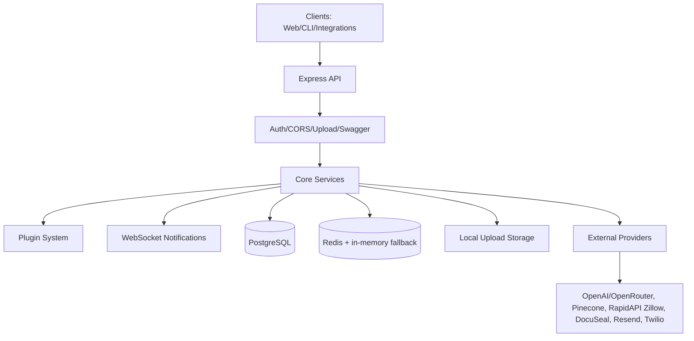
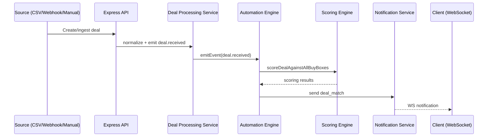
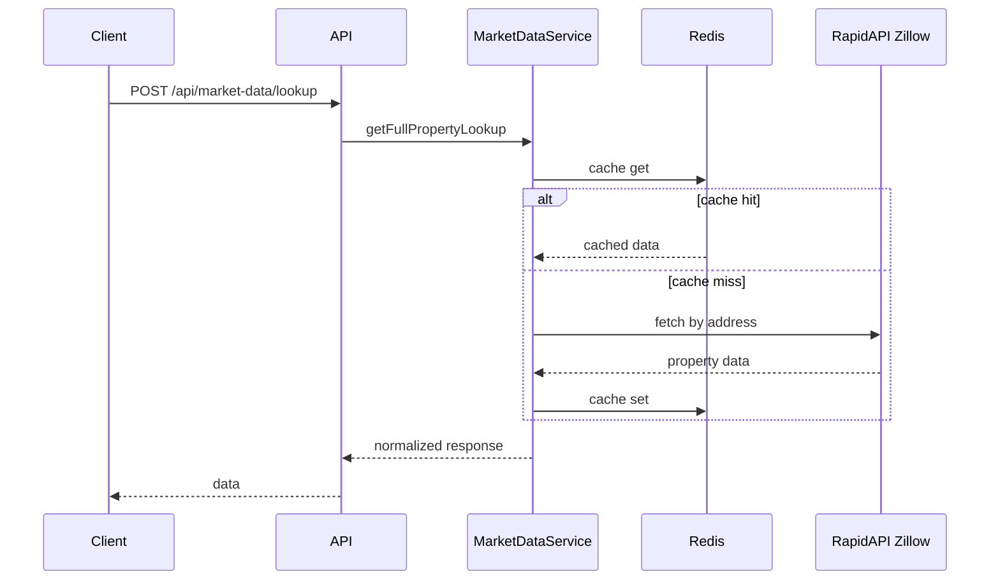

# Dispotree Backend Architecture

## Overview

Dispotree is a modular real estate deal platform that combines ingestion, scoring,
automation, AI tooling, and a marketplace layer into one backend.

## High-Level Flow

## Core Capabilities

- Property lifecycle: CRUD, bulk operations, documents, uploads/downloads.
- Deal intelligence: buy-box scoring, match breakdowns, ranking, and analytics.
- Automation: event-driven workflows with retries, audit logging, and notifications.
- AI agent: tool-driven chat for search, analysis, enrichment, and operations.
- Knowledge base: document ingestion, chunking, embeddings, semantic search.
- Market data: RapidAPI Zillow enrichment, cached lookups, fallback data.
- Marketplace: personalized feeds, swipe actions, offers, and predictions.
- Pipeline/portfolio: stage tracking, exports, and conversion metrics.

## Strengths

- Modular service + plugin architecture enables fast extension.
- Resilient runtime with graceful fallbacks for cache, DB, and APIs.
- Clear operational surface with Swagger, health checks, and structured responses.
- Event-driven automation decouples ingestion, scoring, and distribution.

## Key Components (By Area)

- API layer: `src/index.ts`, `src/routes/*`, `src/controllers/*`
- Core services: `src/services/*`
- Plugin system: `src/plugins/*`
- Data models: `src/models/*`
- Knowledge base: `src/services/knowledge/*`
- AI agent: `src/services/agentService.ts`

## Sequence Diagrams

### Deal Ingestion -> Scoring -> Automation -> Notifications

### Market Data Lookup (Cached)

## Deployment and Runtime

### Services and Dependencies

- PostgreSQL is required for persistence (Sequelize models).
- Redis is optional; the system falls back to in-memory caching.
- External providers are optional but unlock features:
  - OpenAI/OpenRouter: AI agent and embeddings.
  - Pinecone: long-term memory and knowledge base vectors.
  - RapidAPI Zillow: market data enrichment.
  - DocuSeal, Resend, Twilio: e-signatures, email, and SMS.

### Storage and Paths

- Uploads: `uploads/documents/<propertyId>/`
- Temp uploads: `uploads/temp/`
- Knowledge base defaults: `knowledge/defaults/`
- Knowledge watcher folder: `KNOWLEDGE_FOLDER` (default `./knowledge`)

### Runtime Endpoints

- API: `http://localhost:3001`
- Swagger docs: `/api-docs`
- OpenAI-compatible API: `/v1/*`
- WebSocket notifications: `/ws/notifications`

### Environment Variables

| Category | Variables | Purpose |
|----------|-----------|---------|
| Server | `PORT`, `NODE_ENV` | Basic server configuration |
| Database | `DATABASE_URL` or `DB_USER`, `DB_PASSWORD`, `DB_HOST`, `DB_PORT`, `DB_NAME` | PostgreSQL connection |
| Auth | `JWT_SECRET`, `JWT_REFRESH_SECRET` | JWT signing |
| Cache | `REDIS_URL` | Redis connection |
| AI | `OPENAI_API_KEY`, `OPENROUTER_API_KEY`, `AGENT_MODEL` | AI agent + embeddings |
| Market Data | `RAPIDAPI_KEY` or `RAPIDAPI_ZILLOW_KEY` | Zillow enrichment |
| Knowledge | `PINECONE_API_KEY`, `KNOWLEDGE_FOLDER` | RAG and file watcher |
| Integrations | `DOCUSEAL_API_KEY`, `RESEND_API_KEY`, `TWILIO_SID`, `TWILIO_AUTH_TOKEN`, `TWILIO_FROM_NUMBER`, `APP_URL` | E-sign, email, SMS, AI provider headers |
